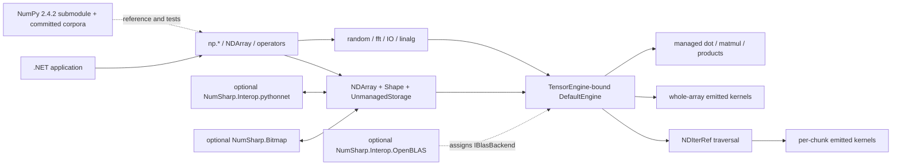

# NumSharp Architecture

This is the authoritative whole-system architecture for NumSharp. It describes the code that exists now, the invariants contributors must preserve, and the target state implied by the project's NumPy 2.x compatibility goal. It intentionally does not duplicate the fast-changing list of individual `np.*` functions.

Last code audit: 2026-08-14.

## 1. Executive assessment

NumSharp is a NumPy-shaped numerical runtime for .NET 8 and .NET 10. Its default product, `NumSharp.Core`, is fully managed in the deployment sense: it owns its numerical kernels in C# and uses no native library or P/Invoke. Internally it is deliberately unsafe and stores homogeneous array data in unmanaged memory.

The stable center of the system is:

- `NDArray`: public array object, lifetime handle, and operation dispatch point;
- `UnmanagedStorage`: typed storage plus the current `Shape` and view ancestry;
- `Shape`: immutable dimensions, element strides, base offset, buffer extent, and cached flags;
- `TensorEngine` / `DefaultEngine`: computation contract and the built-in managed implementation;
- `NDIterRef`: NumPy-style multi-operand traversal over arbitrary layouts;
- emitted kernels: cached scalar/SIMD loops compiled with `DynamicMethod`.

The implementation is mature but the NumPy-compatibility mission is not complete. The core data/layout model, managed execution engine, FFT, `.npy`/`.npz`, and product operations are operational. Important partial areas remain: known parity exceptions are explicitly carried by the differential-fuzz registry; execution is intentionally split between whole-array and NDIter-driven kernels during a migration; most LAPACK factorisations have no managed fallback; and the release workflow does not currently pack the OpenBLAS package.

Status words in this document have precise meanings:

- **operational**: implemented and covered by a representative primary-path test;
- **partial**: meaningful implementation exists, but the intended compatibility or boundary is incomplete;
- **risk**: a correctness, lifetime, native-loading, or delivery boundary needs active care;
- **target**: desired behavior, not a claim about current implementation.

## 2. Context and runtime topology



There is no server, persistence tier, or background service. Process-local state matters instead: the default engine is cached as a singleton, `np.random` is a shared `NumPyRandom` instance, emitted delegates are cached, the optional OpenBLAS backend is installed on the cached engine, and embedded CPython is process-global.

### Project and package boundaries

| Project | Role | Dependencies | Runtime boundary |
|---|---|---|---|
| [`NumSharp.Core`](src/NumSharp.Core/NumSharp.Core.csproj) | Array model, `np` surface, managed engine, iterators, kernels, random, FFT, linalg, and IO | .NET runtime only | Default package; no native dependency or P/Invoke |
| [`NumSharp.Interop.OpenBLAS`](src/NumSharp.Interop.OpenBLAS/NumSharp.Interop.OpenBLAS.csproj) | NumPy-route-compatible float32/float64 `dot` and `matmul` backend | Core plus RID-native OpenBLAS assets | Optional native boundary installed through `IBlasBackend` |
| [`NumSharp.Interop.pythonnet`](src/NumSharp.Interop.pythonnet/NumSharp.Interop.pythonnet.csproj) | Copy and zero-copy exchange with NumPy and PEP 3118 exporters | Core plus `pythonnet` | Optional embedded-CPython boundary |
| [`NumSharp.Bitmap`](src/NumSharp.Bitmap/NumSharp.Bitmap.csproj) | `System.Drawing` conversion extensions | Core plus `System.Drawing.Common` | Optional platform-sensitive imaging boundary |
| [`NumSharp.UnitTest`](test/NumSharp.UnitTest/NumSharp.UnitTest.csproj) | Main parity, kernel, layout, lifetime, IO, OpenBLAS, and corpus gates | Core, Bitmap, OpenBLAS | Runs managed-by-default; enables OpenBLAS only in scoped tests |
| [`NumSharp.Interop.UnitTests`](test/NumSharp.Interop.UnitTests/NumSharp.Interop.UnitTests.csproj) | Live Python/NumPy interop and lifetime gates | Core, pythonnet, Python, NumPy | Sequential because CPython and lifetime counters are process-global |

The repositories under [`src/numpy`](src/numpy/), [`src/pocketfft`](src/pocketfft/), and [`src/OpenBLAS`](src/OpenBLAS/) are pinned source-reference submodules, not Core runtime dependencies. NumPy is the behavioral authority; pocketfft and OpenBLAS are implementation references. The currently pinned NumPy submodule is v2.4.2.

## 3. Stable architecture areas

These IDs are stable references for issues, reviews, and design documents. Add capabilities within an existing area before inventing a new area.

| Area | Status | Boundary | Representative evidence | Target outcome |
|---|---|---|---|---|
| **A1 API and parity contract** | partial | NumPy-shaped public API, overloads, operators, dtype aliases, and parity policy | [`np.cs`](src/NumSharp.Core/APIs/np.cs), [`NDArray.Primitive.cs`](src/NumSharp.Core/Operations/Elementwise/NDArray.Primitive.cs), [fuzz README](test/NumSharp.UnitTest/Fuzz/README.md) | Every supported API has NumPy 2.x signature, dtype, value, exception, and layout parity |
| **A2 Array, shape, dtype, and engine model** | operational | Homogeneous array identity and metadata; per-array engine binding | [`NDArray.cs`](src/NumSharp.Core/Backends/NDArray.cs), [`Shape.cs`](src/NumSharp.Core/View/Shape.cs), [`NPTypeCode.cs`](src/NumSharp.Core/Backends/NPTypeCode.cs), [`BackendFactory.cs`](src/NumSharp.Core/Backends/BackendFactory.cs) | One explicit source of truth for dtype promotion, layout metadata, and engine ownership |
| **A3 Storage and lifetime** | risk | Allocation, pooling, external buffers, reference counting, and deterministic release | [`UnmanagedStorage.cs`](src/NumSharp.Core/Backends/Unmanaged/UnmanagedStorage.cs), [`UnmanagedMemoryBlock<T>`](src/NumSharp.Core/Backends/Unmanaged/UnmanagedMemoryBlock%601.cs), [lifetime tests](test/NumSharp.UnitTest/Lifetime/) | No use-after-free, double-free, leak, or ownership ambiguity for arrays, views, and interop buffers |
| **A4 Layout, views, indexing, and broadcasting** | operational | Element-to-address mapping and shared-memory semantics | [`Shape.Broadcasting.cs`](src/NumSharp.Core/View/Shape.Broadcasting.cs), [`UnmanagedStorage.Slicing.cs`](src/NumSharp.Core/Backends/Unmanaged/UnmanagedStorage.Slicing.cs), [`NDArray.Indexing.cs`](src/NumSharp.Core/Selection/NDArray.Indexing.cs), [view tests](test/NumSharp.UnitTest/View/) | Every operation honors C/F, offset, positive/negative stride, zero stride, scalar, and empty layouts |
| **A5 Iteration and expression execution** | partial | Multi-operand traversal, buffering, casting, overlap handling, and fused expression execution | [`NDIter.cs`](src/NumSharp.Core/Backends/Iterators/NDIter.cs), [`np.nditer.cs`](src/NumSharp.Core/APIs/np.nditer.cs), [`NDExpr.cs`](src/NumSharp.Core/Backends/Iterators/NDExpr.cs) | NDIter is the common layout engine wherever it improves correctness without losing required bits or performance |
| **A6 Managed compute and emitted kernels** | partial | `DefaultEngine` dispatch, dtype promotion, scalar/SIMD kernels, reductions, scans, casts, and managed matrix products | [`DefaultEngine.cs`](src/NumSharp.Core/Backends/Default/DefaultEngine.cs), [`DefaultEngine.BinaryOp.cs`](src/NumSharp.Core/Backends/Default/Math/DefaultEngine.BinaryOp.cs), [`DirectILKernelGenerator.cs`](src/NumSharp.Core/Backends/Kernels/Direct/DirectILKernelGenerator.cs), [`ILKernelGenerator.cs`](src/NumSharp.Core/Backends/Kernels/ILKernelGenerator.cs) | One tested dispatch policy per operation with no duplicate semantic implementation left by migration |
| **A7 Linear algebra and backend seam** | partial | Product operations, optional CBLAS delegation, and backend-only LAPACK factorisations | [`TensorEngine.LinearAlgebra.cs`](src/NumSharp.Core/Backends/TensorEngine.LinearAlgebra.cs), [`IBlasBackend.cs`](src/NumSharp.Core/Backends/IBlasBackend.cs), [`IBlasBackend.LinearAlgebra.cs`](src/NumSharp.Core/Backends/IBlasBackend.LinearAlgebra.cs), [`OpenBlasBackend.cs`](src/NumSharp.Interop.OpenBLAS/OpenBlasBackend.cs) | Managed product fallback stays universal; unsupported factorisations are either implemented by a package or explicitly documented |
| **A8 Domain modules and external interop** | partial | Random, FFT, `.npy`/`.npz`, Python, and bitmap adapters | [`NumPyRandom`](src/NumSharp.Core/RandomSampling/np.random.cs), [`FourierModule`](src/NumSharp.Core/Fourier/np.fft.cs), [`NpyFormat.cs`](src/NumSharp.Core/IO/NpyFormat.cs), [`NDArrayPythonInterop.cs`](src/NumSharp.Interop.pythonnet/NDArrayPythonInterop.cs) | Each module has an explicit dtype/layout/lifetime contract and a parity gate appropriate to its external dependency |
| **A9 Verification and performance evidence** | partial | Unit tests, upstream-derived cases, offline corpora, live interop, fuzzing, and benchmarks | [main tests](test/NumSharp.UnitTest/), [oracle generators](test/oracle/), [committed corpora](test/NumSharp.UnitTest/Fuzz/corpus/), [CI](.github/workflows/build-and-release.yml) | Every claimed capability has a non-vacuous gate; known divergences remain visible and bounded |
| **A10 Build, packaging, and delivery** | risk | Target frameworks, strong naming, NuGet packaging, native-asset discovery, and releases | [`Directory.Build.props`](Directory.Build.props), [build/release workflow](.github/workflows/build-and-release.yml), [OpenBLAS targets](src/NumSharp.Interop.OpenBLAS/buildTransitive/NumSharp.Interop.OpenBLAS.targets) | All advertised packages are rebuilt, verified, packed, and published from the same release graph |

## 4. Capability map

### A1 — API and parity contract

- **CAP-API-01 — NumPy-shaped entry points (partial).** The static partial `np` class owns functions, constants, dtype aliases, `np.random`, and `np.fft`. Instance methods and C# operators normally forward to the same engine operations. Evidence: [`APIs/np.cs`](src/NumSharp.Core/APIs/np.cs), [`Math/`](src/NumSharp.Core/Math/), [`Statistics/`](src/NumSharp.Core/Statistics/), and [`Operations/Elementwise/`](src/NumSharp.Core/Operations/Elementwise/).
- **CAP-API-02 — C#-native typed access (operational).** `NDArray<T>` and typed `np.nditer<T>`/`np.nditer_chunks<T>` add ref-return and span-based access without defining a second traversal engine. Evidence: [`NDArray<T>`](src/NumSharp.Core/Generics/NDArray%601.cs) and [`np.nditer.Typed.cs`](src/NumSharp.Core/APIs/np.nditer.Typed.cs).
- **CAP-API-03 — NumPy 2.x promotion and ufunc controls (partial).** Engine dispatch implements NEP 50-style promotion, widening reductions, and `dtype=`, `out=`, and `where=` on supported ufuncs. Promotion is spread across canonical helpers and operation-specific loop rules, so changes require differential tests. Evidence: [`DefaultEngine.BinaryOp.cs`](src/NumSharp.Core/Backends/Default/Math/DefaultEngine.BinaryOp.cs), [`NDIterCasting.cs`](src/NumSharp.Core/Backends/Iterators/NDIterCasting.cs), and [`DefaultEngine.UfuncOut.cs`](src/NumSharp.Core/Backends/Default/Math/DefaultEngine.UfuncOut.cs).
- **CAP-API-04 — Fused expressions (operational extension).** `np.evaluate` compiles an `NDExpr` tree and evaluates it in one NDIter-driven pass, preserving node-by-node NumPy result types. This is a NumSharp extension analogous to `numexpr`, not a NumPy API claim. Evidence: [`np.evaluate.cs`](src/NumSharp.Core/APIs/np.evaluate.cs) and [`NDExpr.Typing.cs`](src/NumSharp.Core/Backends/Iterators/NDExpr.Typing.cs).

Current gap: API presence is not equivalent to parity. The committed corpus and `OpenBugs` tests deliberately record remaining dtype, exception, random-stream, complex-edge, and host-dependent differences. The authoritative live ledger is the [fuzz README](test/NumSharp.UnitTest/Fuzz/README.md), not a static “implemented functions” list here.

Target: a function may be called NumPy-compatible only when its signature, result dtype, shape, values/bytes, exceptions, and layout behavior are all gated for the relevant dtypes.

### A2 — Array, shape, dtype, and engine model

- **CAP-ARR-01 — Array facade and engine binding (operational).** Each `NDArray` holds `UnmanagedStorage` and a `TensorEngine`. Constructors resolve the engine once from storage or `BackendFactory`; views carry the engine through storage aliases. Binary operators dispatch on the left operand's engine. Evidence: [`NDArray.cs`](src/NumSharp.Core/Backends/NDArray.cs) and [`NDArray.Primitive.cs`](src/NumSharp.Core/Operations/Elementwise/NDArray.Primitive.cs).
- **CAP-SHAPE-01 — Immutable address metadata (operational).** `Shape` is a readonly struct containing `long[]` dimensions and element strides, total size, underlying buffer size, base offset, a cached hash, and cached `ArrayFlags`. Evidence: [`Shape.cs`](src/NumSharp.Core/View/Shape.cs) and [`Shape.Reshaping.cs`](src/NumSharp.Core/View/Shape.Reshaping.cs).
- **CAP-DTYPE-01 — Fifteen computational dtypes (operational with per-operation gaps).** Boolean, Byte, SByte, Int16, UInt16, Int32, UInt32, Int64, UInt64, Char, Half, Single, Double, Decimal, and Complex are the required kernel matrix. `Complex` is complex128; complex64 is explicitly unsupported. `Decimal` is a NumSharp extension without a NumPy dtype and uses an independent oracle. `NPTypeCode.String` exists as a legacy enum value but is not part of the 15-type numerical-engine contract. Evidence: [`NPTypeCode.cs`](src/NumSharp.Core/Backends/NPTypeCode.cs), [`np.cs`](src/NumSharp.Core/APIs/np.cs), and [dtype kernel tests](test/NumSharp.UnitTest/Backends/Kernels/DtypeCoverageTests.cs).
- **CAP-ENG-01 — Cached default engine (operational).** `BackendFactory` returns one `EngineCache<DefaultEngine>.Value`; `BackendType` currently contains only `Default`. The generic factory hook can cache another engine type, but the public enum is not a runtime engine registry. Evidence: [`BackendFactory.cs`](src/NumSharp.Core/Backends/BackendFactory.cs) and [`BackendType.cs`](src/NumSharp.Core/Backends/BackendType.cs).

Current gap: `np.BackendEngine` is declared but has no reader, so it is not a working engine-selection control. `np.evaluate` also resolves the cached default engine directly rather than selecting an operand's engine. These are legacy extensibility seams, not evidence that whole-engine swapping is operational.

Target: make engine selection semantics explicit—either remove inert selection surface or route it consistently—while retaining the property-based BLAS decoration described in A7.

### A3 — Storage and lifetime

- **CAP-MEM-01 — Unmanaged allocation and pooling (operational).** Typed `UnmanagedMemoryBlock<T>` instances allocate from size-bucketed pools, can use OS virtual memory for large zeroed allocations, or wrap external/pinned memory. `UnmanagedStorage` erases the element type behind `IArraySlice`. Evidence: [`UnmanagedMemoryBlock<T>`](src/NumSharp.Core/Backends/Unmanaged/UnmanagedMemoryBlock%601.cs), [`SizeBucketedBufferPool.cs`](src/NumSharp.Core/Backends/Unmanaged/Pooling/SizeBucketedBufferPool.cs), and [`UnmanagedStorage.cs`](src/NumSharp.Core/Backends/Unmanaged/UnmanagedStorage.cs).
- **CAP-MEM-02 — Atomic shared lifetime (operational).** Every concrete `NDArray` construction acquires a logical reference. `Dispose` idempotently releases it; a finalizer is the safety net. The memory block's shared disposer frees owned memory exactly once when the last reference is released. Views therefore remain valid after an original wrapper is collected or disposed. Evidence: [`NDArray.cs`](src/NumSharp.Core/Backends/NDArray.cs), [`IArraySlice.cs`](src/NumSharp.Core/Backends/Unmanaged/Interfaces/IArraySlice.cs), and [lifetime tests](test/NumSharp.UnitTest/Lifetime/).
- **CAP-MEM-03 — External ownership modes (risk).** A raw pointer constructor without a disposer is non-owning; pinned or custom-disposer blocks transfer only the declared cleanup responsibility. Python zero-copy views add cross-runtime keep-alive objects. Evidence: [`UnmanagedMemoryBlock<T>`](src/NumSharp.Core/Backends/Unmanaged/UnmanagedMemoryBlock%601.cs) and [pythonnet lifetime design](src/NumSharp.Interop.pythonnet/README.md#lifetime--memory-safety-the-design).

Non-negotiable invariant: no pointer may outlive the owner that makes its storage valid. `NDArray.@base` represents NumPy-style semantic ancestry, but the shared disposer—not wrapper object identity—is what keeps memory alive.

Target: every new allocation or interop path must declare owned, borrowed, pinned, or callback-owned lifetime and add a disposal/leak test.

### A4 — Layout, views, indexing, and broadcasting

- **CAP-VIEW-01 — Shared-memory basic views (operational).** Basic slicing, transpose, and compatible reshape create storage aliases with new `Shape` metadata. A view's base storage points to the ultimate owner rather than forming an unbounded chain. Explicit `copy()` is the detach operation. Evidence: [`UnmanagedStorage.Slicing.cs`](src/NumSharp.Core/Backends/Unmanaged/UnmanagedStorage.Slicing.cs), [`NDArray.Indexing.cs`](src/NumSharp.Core/Selection/NDArray.Indexing.cs), and [`NDArray.View.Test.cs`](test/NumSharp.UnitTest/View/NDArray.View.Test.cs).
- **CAP-IDX-01 — Basic, advanced, mask, and assignment indexing (partial).** String/Python-style slices, ellipsis, new axis, integer arrays, boolean masks, selections, and setters are implemented through the `Selection` and `Indexing` layers. The differential index corpora are the compatibility authority. Evidence: [`Selection/`](src/NumSharp.Core/Selection/), [`Indexing/`](src/NumSharp.Core/Indexing/), and [`IndexOracleTests.cs`](test/NumSharp.UnitTest/Fuzz/IndexOracleTests.cs).
- **CAP-BCAST-01 — Zero-stride broadcasting (operational).** Broadcasting aligns trailing axes and represents expansion with element stride 0. A non-empty broadcast shape clears `WRITEABLE` because multiple logical elements alias one physical slot. Evidence: [`Shape.Broadcasting.cs`](src/NumSharp.Core/View/Shape.Broadcasting.cs), [`np.broadcast_to.cs`](src/NumSharp.Core/Creation/np.broadcast_to.cs), and [`NDIterWriteMaskedTests.cs`](test/NumSharp.UnitTest/Backends/Iterators/NDIterWriteMaskedTests.cs).
- **CAP-ORDER-01 — C/F/A/K-aware public layout (operational with legacy constructor caveat).** `OrderResolver`, `Shape` flags, creation helpers, cast/copy, iterator order, and IO understand C and F contiguity. Raw `NDArray(..., char order)` constructors still accept and ignore the order argument; public `np.array` and related APIs materialize the requested layout above them. Evidence: [`OrderResolver.cs`](src/NumSharp.Core/View/OrderResolver.cs), [`np.array.cs`](src/NumSharp.Core/Creation/np.array.cs), and [`Shape.Order.Tests.cs`](test/NumSharp.UnitTest/View/Shape.Order.Tests.cs).

Address equation:

```text
elementOffset = Shape.Offset + Σ(index[d] * Shape.Strides[d])
byteAddress   = storageBase + elementOffset * dtypeSize
```

Empty arrays, scalars, size-one axes, negative strides, F-contiguous arrays, and stride-zero arrays are distinct layouts even when some flags coincide. Never infer addressing from `IsContiguous` alone.

Target: layout support is part of every operation's definition of done, not a later optimization pass.

### A5 — Iteration and expression execution

- **CAP-ITER-01 — Multi-operand NDIter core (operational).** `NDIterRef` is a stack-only iterator over unmanaged state. It performs broadcasting, axis remapping, dimension coalescing, C/F/A/K ordering, buffering, casting, reduction setup, overlap handling, masks, and synchronized pointer advancement. Evidence: [`NDIter.cs`](src/NumSharp.Core/Backends/Iterators/NDIter.cs), [`NDIterCasting.cs`](src/NumSharp.Core/Backends/Iterators/NDIterCasting.cs), [`NDIterBufferManager.cs`](src/NumSharp.Core/Backends/Iterators/NDIterBufferManager.cs), and [iterator parity tests](test/NumSharp.UnitTest/Backends/Iterators/NDIterNumPyParityTests.cs).
- **CAP-ITER-02 — Managed iterator surfaces (operational).** `np.nditer` owns detached iterator state and must be disposed so buffered writes and update-if-copy data are flushed. `np.nditer<T>` and `np.nditer_chunks<T>` create fresh stack-only cursors and expose refs/spans without boxing. `np.ndenumerate`, `np.ndindex`, nested iterators, and `np.broadcast` compose the same traversal concepts. Evidence: [`np.nditer.cs`](src/NumSharp.Core/APIs/np.nditer.cs), [`np.nditer.Typed.cs`](src/NumSharp.Core/APIs/np.nditer.Typed.cs), and [`np.nested_iters.cs`](src/NumSharp.Core/APIs/np.nested_iters.cs).
- **CAP-ITER-03 — Per-chunk kernel contract (operational).** NDIter calls inner loops with `void** dataptrs`, per-operand **byte** strides, a chunk count, and auxiliary data. The iterator owns outer-loop movement; the kernel owns only the current inner chunk. Evidence: [`NDIterKernels.cs`](src/NumSharp.Core/Backends/Iterators/NDIterKernels.cs) and [`ILKernelGenerator.cs`](src/NumSharp.Core/Backends/Kernels/ILKernelGenerator.cs).
- **CAP-EXPR-01 — One-pass expression iteration (operational).** `NDExpr` resolves NumPy types at every node, compiles a cached inner loop, and executes it through NDIter with overlap-safe output handling. Evidence: [`NDExpr.cs`](src/NumSharp.Core/Backends/Iterators/NDExpr.cs), [`NDExpr.Evaluate.cs`](src/NumSharp.Core/Backends/Iterators/NDExpr.Evaluate.cs), and [`DefaultEngine.Evaluate.cs`](src/NumSharp.Core/Backends/Default/Math/DefaultEngine.Evaluate.cs).

Critical unit boundary: `Shape.Strides` and `Shape.Offset` are in elements; the NDIter inner-loop ABI uses byte strides. Convert at the boundary once and never mix the two.

Target: finish operation-by-operation migration only where corpus bits, layout coverage, and benchmarks show the NDIter route is safe. Passing tests are required; architectural neatness alone is not sufficient reason to change summation or traversal order.

### A6 — Managed compute and emitted kernels

- **CAP-KRN-01 — DefaultEngine dispatch (operational).** Public functions validate/compose at the API layer or delegate to the input array's engine. `DefaultEngine` resolves loop dtype, shapes, `out`/`where`, and execution route, then invokes a managed kernel. Evidence: [`TensorEngine.cs`](src/NumSharp.Core/Backends/TensorEngine.cs), [`DefaultEngine.cs`](src/NumSharp.Core/Backends/Default/DefaultEngine.cs), and [`DefaultEngine.BinaryOp.cs`](src/NumSharp.Core/Backends/Default/Math/DefaultEngine.BinaryOp.cs).
- **CAP-KRN-02 — Whole-array emitted kernels (operational, migration source).** `DirectILKernelGenerator` contains operation-family partials for binary/unary work, comparisons, reductions, scans, casts, masking, selection, matmul helpers, and other specialized operations. These delegates accept whole-array metadata and own their traversal. Evidence: [`Backends/Kernels/Direct/`](src/NumSharp.Core/Backends/Kernels/Direct/) and [`GeneratedDelegates.cs`](src/NumSharp.Core/Backends/Kernels/GeneratedDelegates.cs).
- **CAP-KRN-03 — NDIter-driven emitted kernels (operational, migration target).** `ILKernelGenerator` registers operation-specific per-chunk kernels for reductions, scans, and `where`. The generic inner-loop compiler currently lives in `DirectILKernelGenerator.InnerLoop.cs` and is also used by binary Tier 3B and `NDExpr`; this is a shared compiler exception to the class-name boundary, not a second iterator. Evidence: [`ILKernelGenerator.Reduction.cs`](src/NumSharp.Core/Backends/Kernels/ILKernelGenerator.Reduction.cs), [`ILKernelGenerator.Scan.cs`](src/NumSharp.Core/Backends/Kernels/ILKernelGenerator.Scan.cs), and [`DirectILKernelGenerator.InnerLoop.cs`](src/NumSharp.Core/Backends/Kernels/Direct/DirectILKernelGenerator.InnerLoop.cs).
- **CAP-SIMD-01 — Runtime width selection (operational).** The generator detects Vector512, Vector256, Vector128, or scalar-only execution once at startup. Dtype and layout decide whether a route is full-width SIMD, scalar broadcast, inner-chunk SIMD, or general strided scalar. Half, Complex, and Decimal use specialized/scalar behavior where BCL vector arithmetic is unavailable or unsuitable. Evidence: [`DirectILKernelGenerator.cs`](src/NumSharp.Core/Backends/Kernels/Direct/DirectILKernelGenerator.cs), [`KernelOp.cs`](src/NumSharp.Core/Backends/Kernels/KernelOp.cs), and [`StrideDetector.cs`](src/NumSharp.Core/Backends/Kernels/StrideDetector.cs).
- **CAP-REDUCE-01 — Hybrid reduction policy (partial).** Some float, complex, decimal, and half reductions use NDIter per-chunk kernels; other dtype/operation/layout cells remain on direct kernels. NumPy pairwise versus sequential accumulation order is deliberately reproduced where bits depend on axis orientation. Evidence: [`DefaultEngine.ReductionOp.cs`](src/NumSharp.Core/Backends/Default/Math/DefaultEngine.ReductionOp.cs), [`ILKernelGenerator.Reduction.Pairwise.cs`](src/NumSharp.Core/Backends/Kernels/ILKernelGenerator.Reduction.Pairwise.cs), and [`PairwiseSumParityTests.cs`](test/NumSharp.UnitTest/Backends/Kernels/PairwiseSumParityTests.cs).

The fallback hierarchy is a correctness mechanism, not accidental complexity: trivial contiguous fast paths, NDIter routes, whole-array kernels, and scalar fallbacks each cover different combinations while migration proceeds.

Target: retire duplicate semantic paths only after the retained route proves all 15 dtypes or explicitly rejects a dtype, all required layouts, NumPy results/exceptions, and performance regression thresholds.

### A7 — Linear algebra and backend seam

- **CAP-PROD-01 — Managed product family (operational).** `dot`, `matmul`, `inner`, `vdot`, `vecdot`, `matvec`, `vecmat`, `outer`, `tensordot`, `einsum`, `multi_dot`, and `matrix_power` have managed paths. Managed `matmul` is stride-aware and includes SIMD plus generic dtype fallbacks. Evidence: [`LinearAlgebra/`](src/NumSharp.Core/LinearAlgebra/), [`Default.MatMul.cs`](src/NumSharp.Core/Backends/Default/Math/BLAS/Default.MatMul.cs), and [`products.jsonl`](test/NumSharp.UnitTest/Fuzz/corpus/products.jsonl).
- **CAP-BLAS-01 — Optional try-shaped backend (operational).** `TensorEngine.Blas` is null by default. An `IBlasBackend` may accept a product; false means the managed engine continues. Engine code reads the settable property into a local before calling it so concurrent disable cannot create a test-then-call null race. Evidence: [`TensorEngine.cs`](src/NumSharp.Core/Backends/TensorEngine.cs), [`IBlasBackend.cs`](src/NumSharp.Core/Backends/IBlasBackend.cs), and [`Default.Dot.cs`](src/NumSharp.Core/Backends/Default/Math/BLAS/Default.Dot.cs).
- **CAP-OPENBLAS-01 — NumPy-route-compatible matrix products (operational when load succeeds).** The optional package implements separate NumPy `dot` and `matmul` dispatchers for float32/float64, including whole-stack matmul. A module initializer installs the backend on the cached default engine; referencing the package is the normal opt-in, and explicit `Enable`/`Disable` controls it. Evidence: [`OpenBlasBackend.cs`](src/NumSharp.Interop.OpenBLAS/OpenBlasBackend.cs), [`OpenBlasEngine.Binding.cs`](src/NumSharp.Interop.OpenBLAS/OpenBlasEngine.Binding.cs), and [GEMM parity design](docs/GEMM_PARITY.md).
- **CAP-LAPACK-01 — Backend-only factorisations (partial).** `cholesky`, `det`, `slogdet`, `eig`/`eigh`, `inv`, `lstsq`, `qr`, `solve`, and `svd` delegate through default `IBlasBackend` methods. Core has no managed LU/QR/SVD/eigensolver fallback; when the backend declines, `TensorEngine` raises `NotSupportedException`. The shipped OpenBLAS backend currently implements only `dot`/`matmul`, so it does not satisfy these methods. Evidence: [`IBlasBackend.LinearAlgebra.cs`](src/NumSharp.Core/Backends/IBlasBackend.LinearAlgebra.cs), [`TensorEngine.LinearAlgebra.cs`](src/NumSharp.Core/Backends/TensorEngine.LinearAlgebra.cs), and [`OpenBlasBackend.cs`](src/NumSharp.Interop.OpenBLAS/OpenBlasBackend.cs).

Backend implementer invariant: pair `(T*)a.GetData().Address + a.Shape.Offset` with `a.Shape.Strides`. Do not pair a densified `a.GetData<T>().Address` with the original strides.

OpenBLAS parity has three inputs: library bytes, thread count, and dynamic-architecture core selection. The package pins and verifies the bundled library, but the default CPU dispatch intentionally follows the local NumPy unless the caller safely pins a core type. Discovery and override rules are specified in [OPENBLAS_DELIVERY_DESIGN.md](docs/OPENBLAS_DELIVERY_DESIGN.md).

Target: keep Core independent of native libraries; keep optional product backends substitutable and failure-safe; publish a separate backend that implements factorisations or state their unavailability prominently at each API.

### A8 — Domain modules and external interop

- **CAP-RNG-01 — NumPy RandomState-style module (partial).** `np.random` is a shared `NumPyRandom` backed by MT19937. Portable stream operations are corpus-gated; libm-dependent streams can be host-specific, and several samplers remain documented divergences. Evidence: [`np.random.cs`](src/NumSharp.Core/RandomSampling/np.random.cs), [`MT19937.cs`](src/NumSharp.Core/RandomSampling/MT19937.cs), and [`random_parity.jsonl`](test/NumSharp.UnitTest/Fuzz/corpus/random_parity.jsonl).
- **CAP-FFT-01 — Managed pocketfft port (operational for documented scope).** `np.fft` exposes the transform module; the driver handles axes and strides while the managed pocketfft port performs the transform. The intentional dtype boundary is documented separately, including the absence of complex64. Evidence: [`np.fft.cs`](src/NumSharp.Core/Fourier/np.fft.cs), [`PocketFFTDriver.cs`](src/NumSharp.Core/Fourier/PocketFFTDriver.cs), and [FFT parity](docs/FFT_PARITY.md).
- **CAP-IO-01 — NumPy file formats (operational for non-object dtypes).** `NpyFormat` reads/writes v1/v2/v3 headers and array data with layout-aware handling; `NpzFile` is a lazy, cached ZIP-of-NPY reader. Object/pickle dtype is not part of NumSharp's model. Evidence: [`NpyFormat.cs`](src/NumSharp.Core/IO/NpyFormat.cs), [`NpzFile.cs`](src/NumSharp.Core/IO/NpzFile.cs), and [NPY oracle tests](test/NumSharp.UnitTest/IO/NpyOracleTests.cs).
- **CAP-PY-01 — Python copy/view interop (operational when a supported CPython is available).** The pythonnet package offers explicit copy and zero-copy verbs in both directions, supports NumPy array interfaces and PEP 3118 exporters, and registers a codec for automatic marshaling. Shared views couple lifetimes across runtimes and reject unsafe metadata. Evidence: [`NDArrayPythonInterop.cs`](src/NumSharp.Interop.pythonnet/NDArrayPythonInterop.cs), [`NumpyCodec.cs`](src/NumSharp.Interop.pythonnet/NumpyCodec.cs), [interop design](src/NumSharp.Interop.pythonnet/README.md), and [interop tests](test/NumSharp.Interop.UnitTests/).
- **CAP-BMP-01 — Bitmap adapter (operational, platform-sensitive).** The separate Bitmap package converts between `NDArray` and `System.Drawing` image types so Core does not inherit the dependency. Evidence: [`np_.extensions.cs`](src/NumSharp.Bitmap/np_.extensions.cs) and [bitmap tests](test/NumSharp.UnitTest/NumSharp.Bitmap/).

Target: external adapters remain separate packages; Core data/layout invariants cross the boundary without exposing ownership ambiguity or forcing optional dependencies on all consumers.

### A9 — Verification and performance evidence

- **CAP-TEST-01 — Main cross-platform test gate (operational but filtered).** CI builds and tests net8.0 and net10.0 on Windows, Linux, and macOS. `OpenBugs` and high-memory categories are excluded from the normal gate by design; their existence must not be interpreted as parity completion. Evidence: [build/release workflow](.github/workflows/build-and-release.yml) and [`NumSharp.UnitTest.csproj`](test/NumSharp.UnitTest/NumSharp.UnitTest.csproj).
- **CAP-ORACLE-01 — Upstream-derived offline corpora (operational).** Python generators execute NumPy, serialize results/layout/error facts, and commit JSONL corpora that normal CI replays without Python. Decimal uses an independent C# oracle. Evidence: [`test/oracle/`](test/oracle/), [`FuzzCorpusTests.cs`](test/NumSharp.UnitTest/Fuzz/FuzzCorpusTests.cs), and [`Fuzz/corpus/`](test/NumSharp.UnitTest/Fuzz/corpus/).
- **CAP-FUZZ-01 — Differential soak (operational).** Nightly fuzzing combines fixed and fresh seeds, runs against NumPy, shrinks divergences, and uploads failing corpora. Regressions should move into the committed corpus. Evidence: [fuzz-soak workflow](.github/workflows/fuzz-soak.yml) and [`fuzz_random.py`](test/oracle/fuzz_random.py).
- **CAP-INTEROP-TEST-01 — Live Python gate (operational when required host loads).** CI installs Python and NumPy and forces the interop engine to load; tests are sequential and include byte contracts plus live export/import leak counters. Evidence: [interop CI job](.github/workflows/build-and-release.yml) and [`AssemblyInfo.cs`](test/NumSharp.Interop.UnitTests/AssemblyInfo.cs).
- **CAP-PERF-01 — Benchmarks and path-specific tests (partial).** Benchmark projects and performance assertions cover hot paths, but architecture decisions must cite the exact dataset, runtime, CPU, layout, dtype, and build configuration. Evidence: [`benchmark/`](benchmark/), [`test/NumSharp.Benchmark/`](test/NumSharp.Benchmark/), and [benchmark workflow](.github/workflows/benchmark.yml).

Test interpretation rules:

1. A passing focused test proves only the exercised path.
2. An `Inconclusive` host-pinned test is neither failure nor verification.
3. A registry excuse is visible parity debt, not success.
4. Bit parity is required where NumPy's algorithm defines the observable bits; mathematical closeness is not a substitute.
5. Performance results are not portable unless the host, vector width, BLAS settings, and layouts are recorded.

Target: every architecture capability links to a representative gate, and every skip/excuse remains diagnosable and bounded.

### A10 — Build, packaging, and delivery

- **CAP-PKG-01 — Multi-targeted signed packages (operational for built projects).** Core, Bitmap, OpenBLAS, and pythonnet target net8.0/net10.0 and are co-versioned. Repository-wide strong naming is configured in `Directory.Build.props`; it provides assembly identity, not publisher authenticity. Evidence: [`Directory.Build.props`](Directory.Build.props) and the four project files under [`src/`](src/).
- **CAP-SIGN-01 — Strong-name verification (operational).** CI validates the committed key and inspects packed assemblies for the expected public key and a real strong-name signature. Evidence: [verify-signing job](.github/workflows/build-and-release.yml) and [`verify_strong_name.cs`](.github/scripts/verify_strong_name.cs).
- **CAP-OB-DELIVERY-01 — Bundled and overrideable native assets (operational).** The OpenBLAS package carries per-RID native assets, manifest/hash metadata, transitive MSBuild props/targets, a self-healing version cache, and runtime discovery. Explicit and version-pinned requests have stronger failure semantics than ambient discovery. Evidence: [`NumSharp.Interop.OpenBLAS.csproj`](src/NumSharp.Interop.OpenBLAS/NumSharp.Interop.OpenBLAS.csproj), [`NumSharp.Interop.OpenBLAS.targets`](src/NumSharp.Interop.OpenBLAS/buildTransitive/NumSharp.Interop.OpenBLAS.targets), and [package README](src/NumSharp.Interop.OpenBLAS/README.md).
- **CAP-REL-01 — Tag-driven release (partial/risk).** The release workflow builds, packs, signs, and publishes Core, Bitmap, and pythonnet. At this audit, its release pack/publish graph omits `NumSharp.Interop.OpenBLAS` even though that project is in the solution and generates a package. Evidence: [build/release workflow](.github/workflows/build-and-release.yml) and [`SciSharp.NumSharp.sln`](SciSharp.NumSharp.sln).

Target: release CI derives its package list from one explicit manifest or validates the hand-maintained list against all shippable projects. A release must fail if an advertised package is absent, stale, unsigned, or built from different version inputs.

## 5. Primary flows

### 5.1 Creation and ownership

```text
np.array / zeros / empty / frombuffer
  -> validate dtype, shape, copy, and order
  -> construct NDArray bound to a TensorEngine
  -> DefaultEngine.GetStorage creates UnmanagedStorage
  -> storage allocates or wraps a typed IArraySlice / memory block
  -> Shape records dimensions, element strides, offset, buffer size, and flags
  -> NDArray acquires one logical memory reference
```

Creation functions own NumPy policy. Low-level constructors are mechanisms and may retain compatibility quirks such as ignored order arguments.

### 5.2 Basic view

```text
array[slice] / transpose / compatible reshape
  -> normalize indices and axes
  -> derive dimensions, strides, and base offset
  -> alias the same IArraySlice and preserve engine
  -> point BaseStorage at the ultimate owner
  -> acquire an independent NDArray lifetime reference
```

Writes pass through to the owner unless the shape is read-only. Fancy indexing may allocate rather than alias; NumPy behavior, not syntax alone, decides.

### 5.3 Elementwise ufunc

```text
np.add(a, b) or a + b
  -> dispatch on a.TensorEngine
  -> resolve NEP 50 loop dtype and ufunc-specific rules
  -> validate/broadcast inputs and out/where
  -> choose trivial contiguous, NDIter inner-loop, whole-array, or scalar fallback
  -> execute cached emitted delegate
  -> preserve required result order and return out or a new NDArray
```

### 5.4 Reduction or scan

```text
np.sum / mean / var / cumsum
  -> normalize axis and output dtype
  -> handle scalar, empty, and trivial-axis contracts
  -> choose NDIter reduction/scan or direct axis/flat kernel by dtype + layout + op
  -> reproduce NumPy accumulation order where observable
  -> apply keepdims and out semantics
```

### 5.5 Matrix product

```text
np.dot / np.matmul
  -> dispatch on left.TensorEngine
  -> read TensorEngine.Blas once
  -> optional backend accepts exact supported operand family
     OR returns false
  -> managed shape/broadcast dispatcher
  -> stride-aware SIMD or generic managed kernel
```

`dot` and `matmul` are separate backend calls because NumPy uses different dispatchers and can produce different bits for non-BLASable operands.

### 5.6 Python zero-copy exchange

```text
Python exporter -> validate format/shape/strides/address/writeability
  -> construct borrowed NumSharp storage with Python keep-alive
  -> expose Shape in element-stride units

NDArray -> validate supported dtype/layout
  -> create Python owner/capsule keeping NumSharp memory alive
  -> expose NumPy/Python view metadata
```

Copy verbs deliberately break this coupled lifetime; view verbs deliberately preserve it.

## 6. System-wide invariants

| ID | Invariant | Consequence |
|---|---|---|
| **INV-01** | NumPy 2.x observed behavior is the compatibility authority. | Probe the pinned NumPy source/runtime before designing a fix; do not normalize away odd edge behavior. |
| **INV-02** | `Shape.Strides` and `Shape.Offset` use elements; NDIter inner strides use bytes. | Convert explicitly at the ABI boundary. A unit mix is memory corruption, not a rounding error. |
| **INV-03** | A view is `(shared buffer, dimensions, strides, offset, flags)`. | Every kernel must honor offset, arbitrary stride, and buffer bounds; raw flat address loops require a proven layout gate. |
| **INV-04** | Non-empty stride-zero broadcast views are read-only. | All setters, `out=`, fused paths, and external adapters must reject writes before bypassing guarded accessors. |
| **INV-05** | `NDArray` lifetime references, not `base` wrapper identity, own native memory. | Every constructor/view/disposal path must balance acquire/release; external owners need an explicit keep-alive. |
| **INV-06** | Core computation has a managed path except explicitly backend-only factorisations. | Optional packages may change implementation, never silently remove a managed product capability. |
| **INV-07** | An `IBlasBackend` decline is normal control flow. | Try methods leave fallback possible; required/pinned native-load failures must be distinguished from an unsupported operand. |
| **INV-08** | Result dtype is part of the API. | Value-equal output in the wrong dtype is a failure, including reductions and weak-scalar cases. |
| **INV-09** | Traversal and accumulation order can be observable. | Refactors must check byte parity and host dependence, especially reductions, random transforms, FFT, and BLAS. |
| **INV-10** | Empty arrays and 0-D arrays are first-class shapes. | Never treat size 0 or rank 0 as ordinary loop cases without the operation's explicit NumPy contract. |
| **INV-11** | The 15-dtype matrix is the default operation contract. | A missing dtype needs an explicit unsupported decision and test; switch fallthrough is not documentation. |
| **INV-12** | Optional dependencies remain outside Core. | Python, native BLAS, and System.Drawing integration ship as separate packages. |

## 7. Known gaps and prioritized architecture work

| Priority | Gap / risk | Evidence | Measurable target |
|---|---|---|---|
| **P0** | Unsafe storage and external zero-copy paths can turn metadata/lifetime defects into process corruption. | [memory code](src/NumSharp.Core/Backends/Unmanaged/), [interop validation tests](test/NumSharp.Interop.UnitTests/ArrayInterfaceValidationTests.cs) | Every new owner mode has adversarial metadata, aliasing, concurrent disposal, and leak coverage. |
| **P0** | OpenBLAS is a shippable project but absent from the release pack/publish list. | [release workflow](.github/workflows/build-and-release.yml), [OpenBLAS project](src/NumSharp.Interop.OpenBLAS/NumSharp.Interop.OpenBLAS.csproj) | A tagged release produces and verifies all four package artifacts or explicitly marks one non-shippable. |
| **P1** | NumPy parity still has bounded/carved divergences and coverage gaps. | [fuzz README](test/NumSharp.UnitTest/Fuzz/README.md), [`COVERAGE_GAPS.md`](test/NumSharp.UnitTest/Fuzz/COVERAGE_GAPS.md), `OpenBugs` tests | Reduce the registry without broadening excuses; each fix promotes its repro into a normal gate. |
| **P1** | Whole-array and NDIter-driven kernels coexist, including a generic inner-loop compiler under the historical `DirectILKernelGenerator` name. | [kernel directories](src/NumSharp.Core/Backends/Kernels/), [`DefaultEngine.ReductionOp.cs`](src/NumSharp.Core/Backends/Default/Math/DefaultEngine.ReductionOp.cs) | One semantic route per migrated operation; compatibility aliases/compiler placement are documented or renamed without obscuring the driving contract. |
| **P1** | Linalg factorisation APIs expose a seam but the shipped backend implements no LAPACK methods. | [`IBlasBackend.LinearAlgebra.cs`](src/NumSharp.Core/Backends/IBlasBackend.LinearAlgebra.cs), [`OpenBlasBackend.cs`](src/NumSharp.Interop.OpenBLAS/OpenBlasBackend.cs) | Ship a suitable optional backend or make backend requirement and supported dtypes explicit in all public entry points/docs. |
| **P2** | Engine selection has inert/inconsistent legacy surfaces (`np.BackendEngine`, default-engine `np.evaluate`). | [`np.cs`](src/NumSharp.Core/APIs/np.cs), [`np.evaluate.cs`](src/NumSharp.Core/APIs/np.evaluate.cs), [`BackendFactory.cs`](src/NumSharp.Core/Backends/BackendFactory.cs) | One documented selection rule with tests for existing arrays, views, static APIs, and concurrent backend decoration. |
| **P2** | Generated website/API docs and historical plans can lag implementation. | [`docs/website-src`](docs/website-src/), [`docs/plans`](docs/plans/) | The authority order below is linked from focused docs; generated output is refreshed only from current source. |

This table is not a release promise. It is the order in which architecture risk should be reduced when choosing otherwise-equivalent work.

## 8. Development decision guide

When adding or repairing an operation:

1. Locate the corresponding implementation in [`src/numpy`](src/numpy/) and run the pinned NumPy version on dtype, scalar, empty, NaN/Inf/signed-zero, negative-axis, layout, and error cases.
2. Identify the owning area and existing execution family. Do not bypass `Shape`, writeability, dtype promotion, or engine dispatch for convenience.
3. Prefer an API-level composition when it preserves NumPy semantics and avoids avoidable intermediates. Use `DefaultEngine` and emitted kernels for hot or layout-sensitive primitives.
4. For elementwise multi-operand work, prefer the NDIter inner-loop model unless a proven trivial whole-array route is both simpler and faster. Preserve existing bit order.
5. Implement or explicitly reject all 15 computational dtypes. Record Decimal's independent behavior separately where NumPy has no reference.
6. Test C-contiguous, F-contiguous, offset slice, positive stride, negative stride, broadcast stride 0, scalar, and empty shapes as applicable.
7. Add actual NumPy output to a unit test or committed corpus. Add performance evidence for hot-path changes and verify it in Release mode.
8. If a focused design is needed, link it from this document and label current, historical, or target-only sections.

## 9. Verification commands

Representative local gates from the repository root:

```powershell
dotnet build test/NumSharp.UnitTest/NumSharp.UnitTest.csproj --configuration Release
dotnet test test/NumSharp.UnitTest/NumSharp.UnitTest.csproj --configuration Release --no-build --framework net8.0 --filter "TestCategory!=OpenBugs&TestCategory!=HighMemory"
dotnet test test/NumSharp.Interop.UnitTests/NumSharp.Interop.UnitTests.csproj --configuration Release --framework net8.0
git diff --check
```

The interop test command requires a compatible discoverable CPython and NumPy. OpenBLAS host-pinned parity may report `Inconclusive` when the required binary/core configuration cannot be loaded; read the test output rather than treating a non-red run as proof.

Focused subsystem gates and operational details live in:

- [GEMM parity](docs/GEMM_PARITY.md)
- [OpenBLAS delivery design](docs/OPENBLAS_DELIVERY_DESIGN.md)
- [FFT parity](docs/FFT_PARITY.md)
- [Fuzz matrix](test/NumSharp.UnitTest/Fuzz/README.md)
- [Python interop](src/NumSharp.Interop.pythonnet/README.md)
- [OpenBLAS package](src/NumSharp.Interop.OpenBLAS/README.md)

## 10. Documentation authority

Use this order when documents disagree:

1. Observed behavior of the pinned NumPy 2.x reference, where NumSharp claims parity.
2. Current NumSharp source plus a reproducing test or runtime observation.
3. This `ARCHITECTURE.md` for whole-system boundaries, invariants, area IDs, and current/target separation.
4. Current focused design documents linked above for subsystem-specific contracts.
5. Project/package READMEs for installation and public usage.
6. Generated API/website output under `docs/website-src` and `docs/website`.
7. `docs/plans`, handovers, issue snapshots, and release notes as historical or proposed context only.

A plan does not override verified current behavior. A generated document does not override its source. When code intentionally changes an architecture boundary, update this file and the relevant focused design in the same change.
