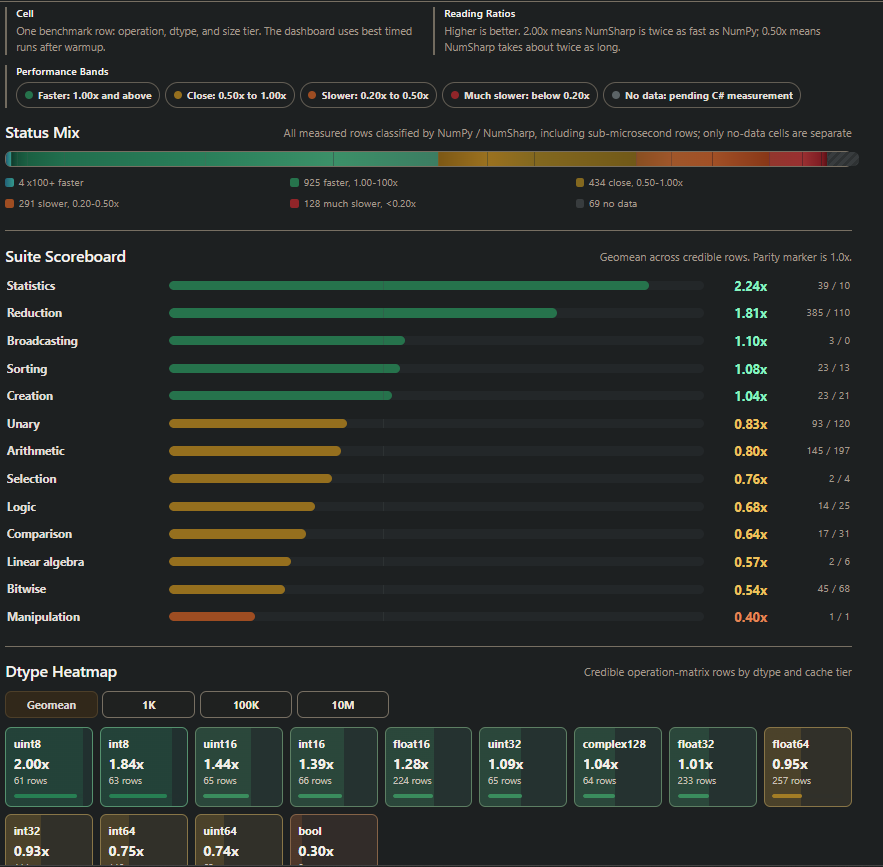
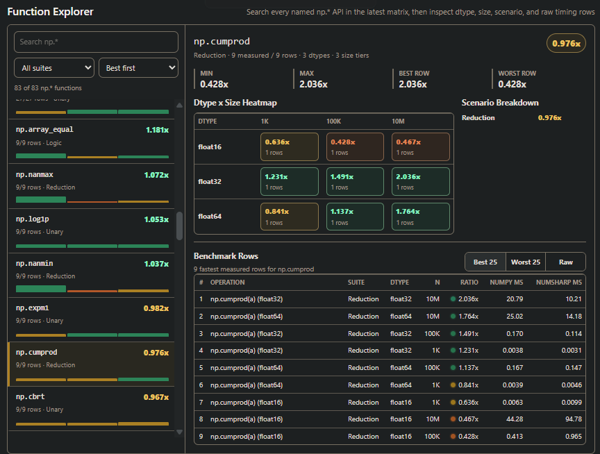

<p align="center">
  <a href="https://github.com/SciSharp/NumSharp">
    
  </a>
</p>

<h1 align="center">NumSharp</h1>

<p align="center">
  <strong>NumPy for .NET</strong>
</p>

<p align="center">
  <a href="https://www.nuget.org/packages/NumSharp"></a>
  <a href="https://www.nuget.org/packages/NumSharp"></a>
  <a href="https://github.com/SciSharp/NumSharp/actions/workflows/build-and-release.yml"></a>
  <a href="https://github.com/SciSharp/NumSharp/actions/workflows/docs.yml"></a>
  <a href="https://scisharp.github.io/NumSharp/docs/benchmarks-dashboard.html"></a>
  <a href="LICENSE"></a>
</p>

<p align="center">
  NumSharp is a native .NET array library with a NumPy-shaped API: <code>NDArray</code>,
  broadcasting, slicing views, dtype-aware <code>np.*</code> functions, unmanaged storage,
  and runtime-generated kernels for performance-sensitive numerical code.
</p>

<p align="center">
  The compatibility target is <strong>NumPy 2.x</strong>. When NumSharp behavior and
  NumPy behavior differ, NumPy is treated as the source of truth.
</p>

## What Is NumSharp?

NumSharp lets C# and F# code use a NumPy-like programming model without embedding
CPython. It is intended for scientific computing, numerical utilities, machine
learning infrastructure, and projects that want NumPy-style array operations in
ordinary .NET code.

NumSharp focuses on:

- NumPy-shaped API names and behavior.
- N-dimensional arrays with shape, stride, offset, and view metadata.
- Broadcasting without materializing repeated values.
- Dtype-aware math, comparisons, reductions, random sampling, and formatting.
- Runtime IL generation and SIMD fast paths where layout and dtype allow it.

## Features

- **NumPy-style `NDArray`** - N-dimensional arrays with shape, strides, offsets,
  slicing, and view semantics. Start with [NDArray fundamentals](docs/website-src/docs/intro.md)
  and [NDArray](docs/website-src/docs/NDArray.md).
- **Broadcasting** - NumPy-style shape expansion without materializing repeated
  values. See [Broadcasting](docs/website-src/docs/broadcasting.md).
- **Dtype-aware operations** - 15 core dtypes with NumPy-oriented promotion and
  conversion behavior. See [Dtypes](docs/website-src/docs/dtypes.md) and
  [NumPy compliance](docs/website-src/docs/compliance.md).
- **Broad `np.*` API surface** - Creation, manipulation, math, reductions,
  comparisons, logic, random sampling, I/O, and formatting. Browse the
  [API reference](docs/website-src/api/index.md).
- **Generated IL and SIMD kernels** - Runtime-specialized kernels for supported
  dtype and layout combinations. See [IL generation](docs/website-src/docs/il-generation.md).
- **Iterator and fusion infrastructure** - NDIter-style execution and fused
  `np.evaluate` expressions for reducing intermediate allocations. See
  [NDIter](docs/website-src/docs/NDIter.md).
- **Tracked performance reports** - Release snapshots with dashboard summaries,
  raw reports, and subsystem matrices. See the
  [benchmark dashboard](docs/website-src/docs/benchmarks-dashboard.md).

## Start Here

Install the core package:

```bash
dotnet add package NumSharp
```

Use familiar NumPy-style calls:

```csharp
using NumSharp;

var a = np.arange(12).reshape(3, 4);
var window = a[":, 1::2"];

Console.WriteLine(window);
Console.WriteLine(np.sum(window, axis: 0));
```

For Python readers, the intended shape is deliberately close:

```python
import numpy as np

a = np.arange(12).reshape(3, 4)
window = a[:, 1::2]
print(window.sum(axis=0))
```

## Documentation Map

This README is the project front door. The docs site is the source for detailed
usage, compatibility, internals, and benchmark reports.

| Need | Start with |
| --- | --- |
| Learn the array model | [NDArray fundamentals](docs/website-src/docs/intro.md) |
| Work with array objects | [NDArray](docs/website-src/docs/NDArray.md) |
| Understand dtype behavior | [Dtypes](docs/website-src/docs/dtypes.md) |
| Use broadcasting | [Broadcasting](docs/website-src/docs/broadcasting.md) |
| Check NumPy parity status | [NumPy compliance](docs/website-src/docs/compliance.md) |
| Inspect current performance | [Benchmark dashboard](docs/website-src/docs/benchmarks-dashboard.md) |
| Read raw benchmark output | [Latest benchmark report](benchmark/history/latest/benchmark-report.md) |
| Understand generated kernels | [IL generation](docs/website-src/docs/il-generation.md) |
| Browse API reference | [API reference](docs/website-src/api/index.md) |

## API Surface

NumSharp implements a broad `np.*` surface modeled after NumPy:

| Area | Examples |
| --- | --- |
| Creation | `array`, `asarray`, `arange`, `linspace`, `zeros`, `ones`, `full`, `eye` |
| Shape manipulation | `reshape`, `ravel`, `transpose`, `concatenate`, `stack`, `squeeze`, `repeat`, `tile` |
| Broadcasting | `broadcast`, `broadcast_to`, `broadcast_arrays` |
| Math | `add`, `subtract`, `multiply`, `divide`, `power`, `sqrt`, `exp`, `log`, trigonometric functions |
| Reductions | `sum`, `prod`, `mean`, `std`, `var`, `min`, `max`, `argmin`, `argmax`, NaN-aware variants |
| Logic and comparison | `equal`, `less`, `greater`, `isclose`, `isnan`, `isfinite`, `logical_and`, `logical_or` |
| Selection and indexing | `where`, `take`, `put`, `nonzero`, `argwhere`, `searchsorted` |
| Linear algebra | `dot`, `matmul`, `outer`, `trace`, `diagonal` |
| Random | `np.random` distributions and NumPy-compatible seed/state behavior |
| I/O and formatting | `load`, `save`, `fromfile`, `tofile`, `array2string`, print options |

For the authoritative list and signatures, use the [API reference](docs/website-src/api/index.md)
and the compatibility documentation.

## NumPy vs NumSharp, Key Differences

NumSharp follows NumPy's model where it can, but it is still a native .NET
implementation. These are the differences that matter most when reading docs,
porting code, or interpreting benchmark results.

| Topic | NumPy | NumSharp | Practical impact |
| --- | --- | --- | --- |
| Runtime | CPython package backed by C/Fortran/native extensions | Native .NET library | No embedded Python runtime; Python extension modules do not automatically work. |
| Main array type | `numpy.ndarray` | `NumSharp.NDArray` | Same mental model: shape, dtype, strides, indexing, views. C# syntax differs. |
| API entry point | `import numpy as np` | `using NumSharp;` then `np.*` | Function names are intentionally familiar; C# overloads can differ where the language requires it. |
| Compatibility target | NumPy 2.x | NumPy 2.x behavior target | NumPy is the source of truth for edge cases and tests. |
| View semantics | Slices usually return views | Slices usually return views | Mutating a writeable view can mutate the base array. |
| Broadcasting | Broadcasted dimensions use stride-zero views | Broadcasted dimensions use stride-zero views | Avoids materializing repeated data; broadcast views are protected from unsafe writes. |
| Core dtype set | Large dtype universe, including platform-specific and Python-object-oriented dtypes | 15 core dtypes: bool, signed/unsigned ints, `char`, `Half`, `float`, `double`, `decimal`, `Complex` | Most numeric code maps directly; dtype-specialized NumPy code may need review. |
| Integer names | `int8`, `uint8`, `int16`, ... | `SByte`, `Byte`, `Int16`, `UInt16`, ... | Same storage widths, .NET-oriented names. See [Dtypes](docs/website-src/docs/dtypes.md). |
| `float16` | `float16` | `System.Half` | Supported, but some arithmetic paths are scalar because .NET has limited `Half` vector arithmetic. |
| Complex | `complex64`, `complex128` | `System.Numerics.Complex` | Complex support is closer to `complex128`; no separate `complex64` dtype. |
| Decimal | Usually object/extension territory | Native `Decimal` dtype | Useful for .NET decimal precision, but not a direct NumPy built-in dtype match. |
| Text/object dtypes | String, unicode, object, and newer string dtype paths | No broad object/string dtype parity; `Char` is .NET-specific | Port text/object-heavy ndarray code deliberately. |
| Type promotion | NumPy 2.x promotion rules | NumPy 2.x promotion target | Promotion-sensitive code should be checked against [NumPy compliance](docs/website-src/docs/compliance.md). |
| Memory layout | C/F order and rich stride combinations | C-order default with stride/view/order-aware APIs | Layout-sensitive performance depends on contiguity, slicing, broadcasting, and dtype. |
| Execution engine | NumPy ufuncs and native kernels | C# engine with generated IL/SIMD kernels | Performance differs by dtype, size, and layout. See [IL generation](docs/website-src/docs/il-generation.md). |
| Benchmarks | NumPy is the comparison baseline | Ratios are reported as `NumPy_ms / NumSharp_ms` | `>1.0x` means NumSharp is faster. See the [benchmark dashboard](docs/website-src/docs/benchmarks-dashboard.md). |
| Missing surface | Full NumPy package | Broad but not complete `np.*` surface | Some APIs remain unimplemented or intentionally different; use docs/API reference as the current source. |

## Performance

NumSharp benchmarks are published as tracked release snapshots, not ad hoc
numbers. The latest checked-in snapshot compares NumSharp with NumPy 2.4.2
across the operation matrix, supported dtypes, three size tiers, and the NDIter,
layout, operand, cast, and fusion subsystems.

<p align="center">
  <a href="https://scisharp.github.io/NumSharp/docs/benchmarks-dashboard.html"></a>
  <a href="https://scisharp.github.io/NumSharp/docs/benchmarks-dashboard.html"></a>
</p>

Benchmark convention:

```text
ratio = NumPy_ms / NumSharp_ms
> 1.0x means NumSharp is faster
< 1.0x means NumPy is faster
```

Latest checked-in headlines:

| Scope | Result |
| --- | ---: |
| 1K operation matrix geomean | 1.14x |
| 100K operation matrix geomean | 0.90x |
| 10M operation matrix geomean | 1.26x |
| NDIter operation matrix geomean | 1.18x |
| Cast subsystem wins | 1,439 / 1,568 comparable cells |

Use the [benchmark dashboard](docs/website-src/docs/benchmarks-dashboard.md) for
visual drilldowns and [latest raw report](benchmark/history/latest/benchmark-report.md)
for the full tables.

Run the official benchmark suite:

```bash
cd benchmark
python run_benchmark.py
```

Useful development variants:

```bash
python run_benchmark.py --quick
python run_benchmark.py --suites arithmetic unary
python run_benchmark.py --skip-build
```

Benchmark runs write tracked history snapshots under
`benchmark/history/<date>_<sha>/` and update `benchmark/history/latest`.
Run C# benchmark scripts in Release; Debug builds materially distort generated
kernel timings.

## Repository Layout

| Path | Purpose |
| --- | --- |
| `src/NumSharp.Core/` | Core `NDArray`, `np.*`, storage, dtype, iterator, and kernel implementation. |
| `src/NumSharp.Bitmap/` | Bitmap interop extension package. |
| `test/NumSharp.UnitTest/` | MSTest suite, including NumPy-derived behavior tests and fuzz corpora. |
| `docs/website-src/` | DocFX documentation source. |
| `benchmark/` | NumSharp-vs-NumPy benchmark orchestration and subsystem scans. |
| `benchmark/history/latest/` | Latest tracked benchmark snapshot. |

## Build and Test

Build:

```bash
dotnet build test/NumSharp.UnitTest/NumSharp.UnitTest.csproj --configuration Release
```

Run the normal CI-style unit test filter:

```bash
dotnet test test/NumSharp.UnitTest/NumSharp.UnitTest.csproj \
  --configuration Release \
  --no-build \
  --framework net8.0 \
  --filter "TestCategory!=OpenBugs&TestCategory!=HighMemory"
```

CI runs on Windows, Linux, and macOS for `net8.0` and `net10.0`.

## Related Projects

If you need to call the full CPython NumPy runtime from .NET, including Python
extension modules NumSharp does not implement, see
[Numpy.NET](https://github.com/SciSharp/Numpy.NET). NumSharp is a native .NET
implementation with a NumPy-shaped API; Numpy.NET bridges into Python.

## License

NumSharp is released under the [Apache License 2.0](LICENSE).

NumSharp is part of the [SciSharp](https://github.com/SciSharp) ecosystem for
machine learning, mathematics, science, and engineering on .NET.
