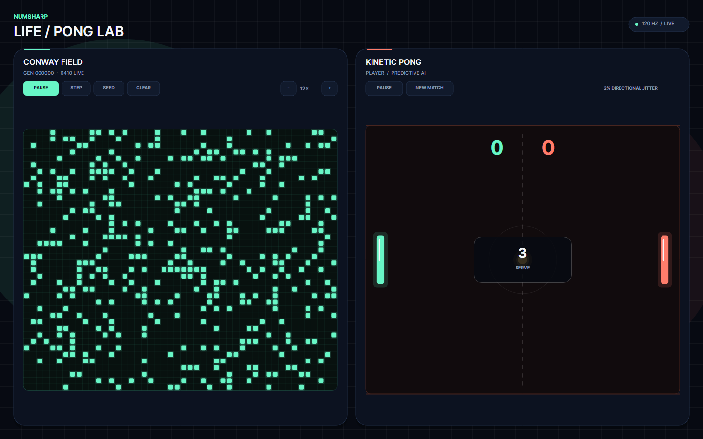

# NumSharp Life Arcade

Life Arcade is a single-player Avalonia game built on NumSharp. One ball moves
between a living Conway colony in the left 70% of the arena and one player
paddle in the right 30%.



The folder name `LifeAndPong` is retained for source compatibility. The current
application is the unified Life Arcade described here; it is not the older
side-by-side Life editor and two-paddle Pong game.

## Gameplay

- Move the right paddle with the mouse over the player side, `W`/`S`, or the
  Up/Down arrow keys.
- Press `Space` to launch, pause, or resume. `Escape` pauses. At game over,
  press `Enter` or choose **Retry**.
- You begin with three lives. Missing the ball consumes one life but keeps the
  score already earned.
- While the ball is in the right 30%, the colony is in **GROW**: bounded Conway
  B3/S23 generations run and sparse Life is replenished.
- When the ball's center crosses into the left 70%, the colony is in
  **SHATTER**: Life freezes, live cells become solid, and a contacted cell is
  destroyed.
- Cell awards within one shot are `+1, +2, +4, +6, +8, ...`. Physical contact
  with the paddle resets the next award and shot counter. Effects escalate at
  20, 50, and 100 destroyed cells in one shot.
- Sound, reduced-motion, and high-contrast options are available from the menu.
  Sound playback is implemented by the Windows desktop host.

The adopted gameplay rules are maintained in [ARCADE_DESIGN.md](ARCADE_DESIGN.md),
and the collision solver is specified in [PHYSICS.md](PHYSICS.md).

## Contributor quickstart

Use a full NumSharp repository checkout. This folder is not a detached build:
the game references `src/NumSharp.Core`, and its focused solution also includes
the repository build tooling required by that project.

Prerequisites for the documented path are Git, PowerShell, and a .NET 10 SDK.
The local `global.json` requests SDK `10.0.100` and permits later .NET 10 feature
bands.

```powershell
git clone https://github.com/SciSharp/NumSharp.git
cd .\NumSharp\examples\LifeAndPong
dotnet --version
.\build.ps1
dotnet run --project .\NumSharp.LifeAndPong.Desktop\NumSharp.LifeAndPong.Desktop.csproj -c Release --no-build
```

`build.ps1` resolves paths from its own directory, restores and builds the
focused solution, and runs the game tests. It can also be invoked by its path
from another current working directory.

### Visual Studio

Open `NumSharp.LifeAndPong.sln`. Set
`NumSharp.LifeAndPong.Desktop` as the startup project, choose the desired build
configuration, and run it. The solution deliberately contains the desktop app,
shared game project, tests, NumSharp.Core, and the repository analyzer project.

### Direct .NET commands

From `examples\LifeAndPong`:

```powershell
dotnet restore .\NumSharp.LifeAndPong.sln --nologo
dotnet build .\NumSharp.LifeAndPong.sln -c Release --no-restore --nologo
dotnet test .\NumSharp.LifeAndPong.Tests\NumSharp.LifeAndPong.Tests.csproj -c Release --no-build --no-restore --nologo
dotnet run --project .\NumSharp.LifeAndPong.Desktop\NumSharp.LifeAndPong.Desktop.csproj -c Release --no-build
```

See [CONTRIBUTING.md](CONTRIBUTING.md) for the source map, change expectations,
and pull-request checklist.

## Create and verify a Windows package

From `examples\LifeAndPong` on Windows:

```powershell
.\publish-windows.ps1

$releaseDir = Get-ChildItem .\artifacts -Directory -Filter 'release-*' |
    Sort-Object LastWriteTimeUtc -Descending |
    Select-Object -First 1
$checksumFile = Join-Path $releaseDir.FullName 'SHA256SUMS'
$archive = Join-Path $releaseDir.FullName 'NumSharp-LifeAndPong-win-x64.zip'
$expected = ((Get-Content -LiteralPath $checksumFile -Raw).Trim() -split '\s+')[0]
$actual = (Get-FileHash -LiteralPath $archive -Algorithm SHA256).Hash.ToLowerInvariant()
$actual -eq $expected
```

The final expression must print `True`. The script runs the Release tests before
publishing. Successful runs leave a new `artifacts\release-<GUID>` directory
containing:

- the self-contained `win-x64` application folder;
- `NumSharp-LifeAndPong-win-x64.zip`; and
- `SHA256SUMS`, which records the ZIP digest.

The application folder and ZIP include the .NET runtime, `LICENSE`, every
Markdown guide at this folder's root, and `preview.png` plus
`preview.ready.png`. The archive is a portable application, not an installer.
After extracting it, start `NumSharp.LifeAndPong.Desktop.exe`.

## Local data

Settings and results are stored in:

```text
%LOCALAPPDATA%\NumSharp\LifeArcade\profile.json
```

Scores are tagged with ruleset `life-arcade-3`. Records from other rulesets may
remain in the file, but the displayed best score compares only current-ruleset
results. If the profile cannot be read or written, play remains available and
the application reports the local persistence error.

## Project status and platform limits

- The checked-in source, tests, and packaging script are the supported
  contributor artifacts; this guide does not assert that a public binary
  release exists.
- The portable package targets Windows x64. Windows audio uses `winmm.dll`.
- Other desktop operating systems and mobile heads are not validated or
  packaged by this project.
- The default window is 1440 × 900 and the enforced minimum is 1120 × 700.
- The repository-root [Life Arcade workflow](https://github.com/SciSharp/NumSharp/actions/workflows/life-arcade.yml)
  defines the Windows build/package automation. A hosted run should be checked
  at that link; local success is not evidence that GitHub Actions ran.

## Project documents

- [CONTRIBUTING.md](CONTRIBUTING.md) — contributor workflow and commands
- [SPECIFICATION.md](SPECIFICATION.md) — current implementation guide
- [ARCADE_DESIGN.md](ARCADE_DESIGN.md) — adopted gameplay behavior
- [PHYSICS.md](PHYSICS.md) — adopted collision model
- [SECURITY.md](SECURITY.md) — vulnerability-reporting guidance
- [CODE_OF_CONDUCT.md](CODE_OF_CONDUCT.md) — link to the NumSharp conduct policy
- [CHANGELOG.md](CHANGELOG.md) — unreleased changes only
- [LICENSE](LICENSE) — Apache License 2.0
