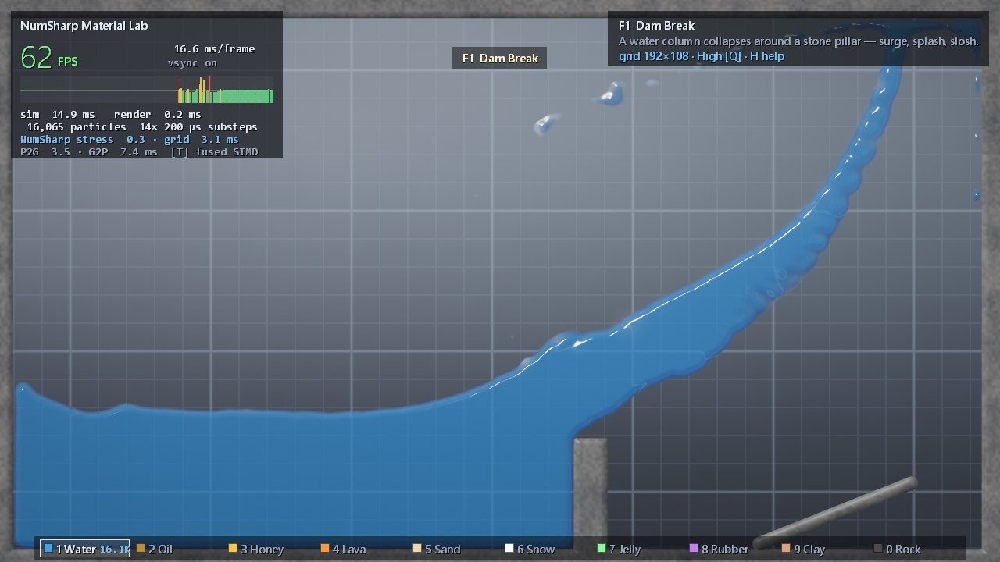
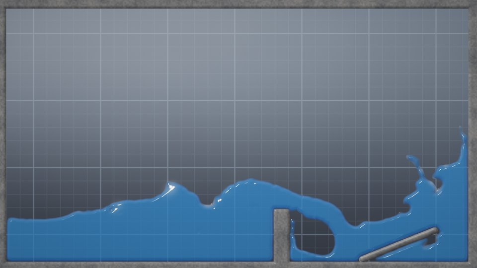
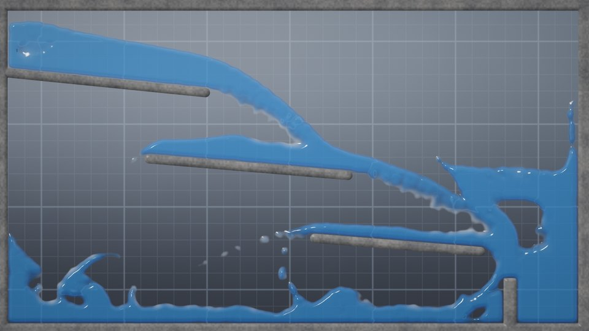
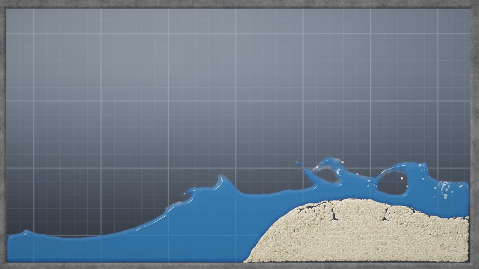
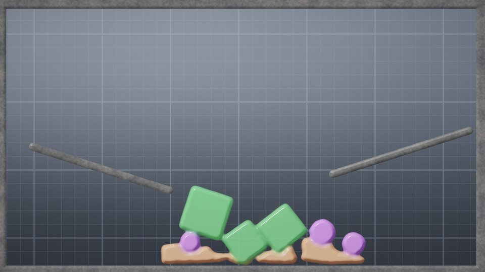
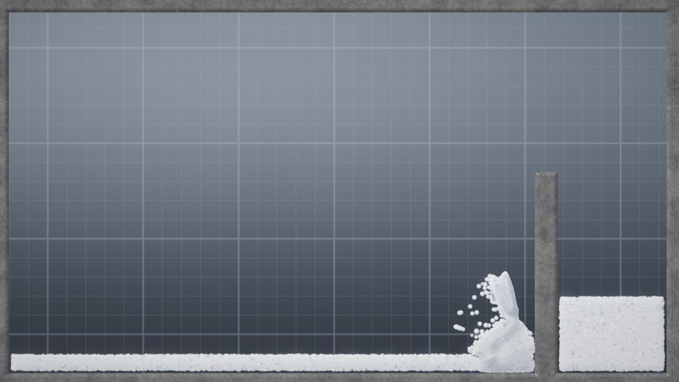
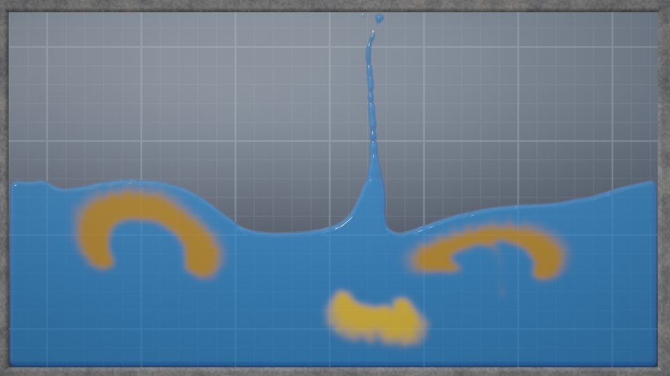
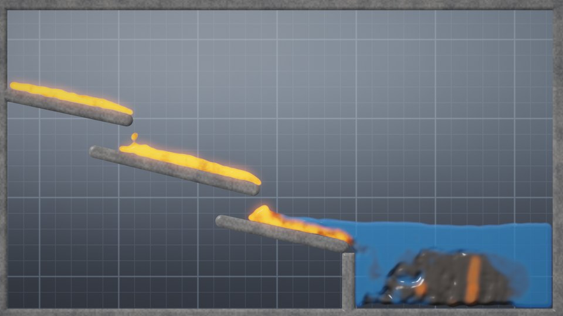
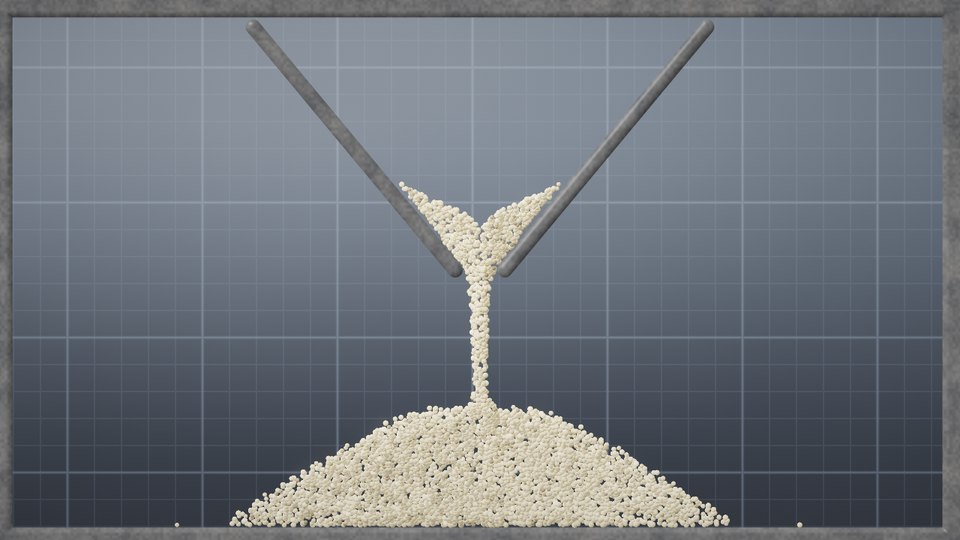
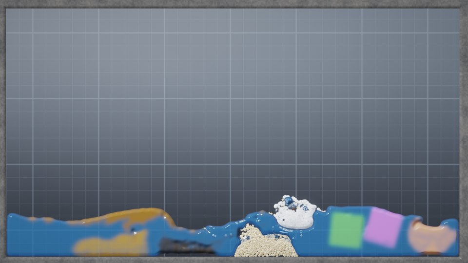

# NumSharp Material Lab



A real-time 2-D simulator of liquids, grains and solids — **water, oil, honey, lava, sand, snow, jelly,
rubber, clay and rock** — all in one tank, all interacting, with a live FPS counter. It runs the **Material
Point Method** (MLS-MPM, the method behind film snow and sand) with a physical constitutive model per material,
at **70–200 FPS on a single CPU core**. NumSharp holds the simulation state (every particle field and the grid)
and computes the material physics and the grid update as fused array expressions. The hottest loop — moving
data between particles and grid — is hand-written SIMD C# over NumSharp's buffers by default; press **T** to
run it as pure NumSharp array math instead, at about a tenth of the speed. [What runs where](#what-runs-on-numsharp--and-what-doesnt)
has the measured split.

It opens a window covering **2/3 of the screen**; **F11** goes borderless fullscreen.

```bash
dotnet run -c Release --project examples/MaterialLab/App
```

Windows only (Win32 window + OpenGL 3.3 through raw P/Invoke — no NuGet packages); .NET 8 SDK.

---

## Controls

| Input | Action |
|---|---|
| **Left drag** | Pour the selected material (it inherits the mouse's speed — fling it) |
| **Right drag** | Stir: drag the material along with the cursor |
| **Shift + left drag** | Paint a stone wall (a smooth capsule stroke) |
| **Shift + right drag** | Carve walls away |
| **Middle drag** / **Ctrl + left drag** | Erase material |
| **Mouse wheel**, **+ / −** | Brush size |
| **1 – 9, 0** | Water, Oil, Honey, Lava, Sand, Snow, Jelly, Rubber, Clay, Rock |
| **F1 – F10** | Scenes (below) |
| **F** / **Shift + F** | Place a faucet of the selected material at the cursor / remove all faucets |
| **← / →** (hold) | Tilt gravity — the whole tank tips |
| **G** | Gravity back to straight down |
| **Space** | Pause |
| **R** | Restart the scene · **C** clear all material |
| **Q** | Quality: grid 128×72 → 160×90 → 192×108 → 224×126 |
| **T** | Swap particle↔grid transfers: fused SIMD kernels ↔ pure NumSharp (`np.bincount` / `np.take`) |
| **V** | VSync on/off · **H** help · **F12** screenshot · **F11** fullscreen · **Esc** quit |

| Command line | |
|---|---|
| `--fullscreen` · `--fraction 0.8` | Start fullscreen · window size as a fraction of the screen (default 2/3) |
| `--scene N` | Start on scene N (1–10, as the F-keys) |
| `--quality low\|medium\|high\|ultra` | Pin the grid resolution (otherwise the lab starts at High and steps down on its own if a scene cannot hold 60 FPS) |
| `--novsync` | Uncapped frame rate |
| `--screenshot out.png --frames K [--hidden] [--nohud]` | Render K frames, save a PNG, exit |
| `--bench K` | Run K frames uncapped and print a per-phase timing summary |

---

## Scenes

| | | |
|---|---|---|
|  **F1 Dam Break** — a water column collapses around a stone pillar: surge, trapped air, slosh. |  **F2 Waterfall** — a faucet cascades down three ledges into a pool. |  **F3 Sandcastle vs Wave** — a moving wave hits a sand castle: erosion and granular collapse. |
|  **F4 Jelly & Rubber** — elastic jelly wobbles, rubber balls bounce, clay takes the dents. |  **F5 Snowballs** — snowballs smash into a wall and a snow bank, packing and fracturing. |  **F6 Oil, Water & Honey** — oil rises in mushroom plumes, honey plunges in (see the Worthington jet) and sinks. |
|  **F7 Lava Flow** — lava runs down rocky steps, crusts as it cools, and freezes to basalt in the lake. |  **F8 Hourglass** — sand drains through a funnel and builds a cone. |  **F9 Material Zoo** — one block of every material dropped side by side. |

**F10 Sandbox** is an empty tank for your own experiments.

---

## The materials

| Key | Material | Model | What to watch |
|---|---|---|---|
| 1 | Water | weakly compressible liquid, inviscid | splashes, waves, air pockets, spray (whitewater on thin sheets and droplets) |
| 2 | Oil | liquid, ρ = 0.72, slightly viscous | rises through water in plumes and spreads into a floating layer |
| 3 | Honey | liquid, ρ = 1.4, viscous | folds and sinks, pools on the bottom |
| 4 | Lava | liquid whose viscosity climbs as it cools; glows by temperature | crusts in air, freezes into **rock** on contact with water |
| 5 | Sand | Drucker–Prager plasticity, 35° friction | piles, avalanches, washes out under water |
| 6 | Snow | Stomakhin snow plasticity with hardening | packs where it is compressed, crumbles where it is pulled |
| 7 | Jelly | soft fixed-corotated elastic solid | wobbles and always recovers its shape |
| 8 | Rubber | stiffer elastic solid | bounces |
| 9 | Clay | von Mises plasticity | keeps every dent |
| 0 | Rock | stiff elastic solid (what lava becomes) | a heavy dark solid; sinks, stacks |

Every pair interacts through the shared grid: sand displaces water and is buoyed by it, oil and snow float,
rubber and rock sink, jelly (as dense as water) hangs where you drop it, and lava crusts in air but freezes
solid in water.

---

## How it works

Each rendered frame advances 2.8 ms of simulated time in 8–21 substeps. A substep is the MLS-MPM loop
(Hu et al. 2018), with APIC transfers:

1. **Constitutive update (NumSharp).** Per material, a pipeline of fused `NDExpr` expressions advances the
   deformation state by the particle's velocity gradient, applies the material's plasticity, and computes the
   stress. 2×2 singular values are solved in closed form (no trigonometry), so the whole update is plain
   array arithmetic.
2. **Particle → grid.** Mass, momentum, stress, volume and "coolant" (water mass, for lava) are scattered to
   the 3×3 surrounding nodes with quadratic B-spline weights.
3. **Grid update (NumSharp).** Momentum → velocity, gravity (in any direction), the stir force, and collision
   with painted walls including Coulomb friction — fused expressions over the node lanes.
4. **Grid → particle.** Velocity and its gradient are gathered back; particles move, cool, and are pushed out
   of walls.

What makes it behave physically, in short (the full story, with equations and measurements, is in
[docs/PHYSICS.md](docs/PHYSICS.md)):

- **Liquids read their volume from their neighbours.** A liquid particle's volume ratio is J = 1/φ, where φ is
  the local occupancy gathered from the grid (1 = packed). Integrating J over time drifts, and the drift shows
  as a slowly growing, cloudy pool; occupancy cannot drift. Walls contribute a *phantom volume* (the exact
  B-spline weight of the kernel lying inside the wall), so liquids do not over-pack against floors: a resting
  pool is compressed by the 1.6 % its equation of state predicts (1.3 %), no more.
- **Buoyancy, twice.** A blob resolved on the grid rises or sinks on its own — the pressure gradient is set by
  the surrounding liquid. Material mixed below the grid scale (a stirred emulsion) separates by a *drift flux*
  v = τ·(ρₚ − ρ_mix)/ρₚ·g.
- **Adaptive time step.** Δt = min(CFL·Δx / fastest wave speed present, ½Δx / fastest particle), so a tank of
  jelly takes the steps jelly needs and a fling from the mouse can never tunnel.
- **Analytic walls.** Walls are exact shapes (disks, capsules, boxes) combined with CSG on a signed distance
  field, so a ramp is a true ramp, not a staircase — water slides along it smoothly.

---

## What runs on NumSharp — and what doesn't

Not everything is a NumSharp operation, by design. NumSharp does what array math is good at — the same law
applied to every particle, the same update applied to every node, sorting — and owns the data. The
particle↔grid transfers are a scatter-add of nine weighted contributions per particle into shared nodes;
expressed as array operations (the **T** mode) they must materialize 9N-element index/weight arrays and call
`np.bincount` per lane, which is far slower than one fused loop. NumPy has the same limitation — MPM in Python is
usually written in Taichi, Numba or CUDA for exactly this step.

| Part of each frame | Implemented as |
|---|---|
| Constitutive physics of all 10 materials | **NumSharp** — fused `NDExpr` kernels, compiled by NumSharp |
| Grid update (velocity, gravity, stir, walls, friction) | **NumSharp** — fused `NDExpr` kernels over the node lanes |
| Spatial sort (every 24 frames) | **NumSharp** — `np.argsort` + `np.take` |
| Particle → grid, grid → particle (default) | **C#** — `Vector256` + FMA loops reading and writing NumSharp's buffers through raw pointers |
| Particle → grid, grid → particle (key **T**) | **NumSharp** — `np.bincount`, `np.take`, fused axis reductions |
| Per-particle finish: advection, drift, wall push-out, lava cooling | **C#** loop (both modes) |
| Walls (distance field, CSG), painting, filling, faucets, lava → rock, Δt choice | **C#** (event-driven or per frame, negligible time) |
| Rendering, HUD, window, input | **GPU** (OpenGL/GLSL) and Win32 — no NumSharp |

All particle state and the simulation grid (nodes, φ, normals) are NumSharp `NDArray`s; only the render-only
fine φ and the node-clear template are plain C# arrays.

Measured (High quality, single thread, i9-13900K P-core, simulation time only):

| Scene | Default: NumSharp operations' share of the step | Default | **T** (transfers in NumSharp) |
|---|---:|---:|---:|
| Dam Break | 19 % | 7.2 ms (138 FPS) | 56 ms (18 FPS) |
| Oil, Water & Honey | 12 % | 13.6 ms (74 FPS) | 128 ms (8 FPS) |
| Hourglass | 46 % | 6.1 ms (165 FPS) | 43 ms (23 FPS) |
| Material Zoo | 31 % | 9.2 ms (109 FPS) | 173 ms (6 FPS) |

In **T** mode about 98 % of the step is NumSharp operations — everything except the per-particle finish loop —
and the two modes agree to float rounding (verified). The fused transfers themselves are 9.5–28× faster than their
NumSharp formulation; the reference P2G is slowest with many materials, because it builds grid-sized bincounts
per material group.

### The NumSharp parts, in detail

The material physics is written as NumSharp array expressions, compiled once and evaluated in place:

```csharp
// Fluids (Constitutive.BuildFluid): pressure K·J(J−1) plus viscosity, into the affine momentum lanes.
NDExpr j = V(PField.Jp), c00 = V(PField.C00), c11 = V(PField.C11);
Stage(Clamp(j * (1.0 + dt * (c00 + c11)), 0.6, 1.0 + _m.TensionLimit), _g[PField.Jp]);
NDExpr pressure = k * j * (j - 1.0);
Stage(s * (pressure + 2.0 * mu * j * c00) + m * c00, _g[SField.A00]);   // one fused SIMD pass
```

- **Constitutive models** — every material is 5–25 fused `NDExpr` stages (`expr.Compile()` once, then
  `CompiledExpression.Evaluate(out)` per substep): the trial deformation gradient, the closed-form σ-space SVD,
  the plastic projection (Drucker–Prager, von Mises, snow clamping with hardening), and the Kirchhoff stress.
  Runtime values — Δt, per-material viscosity caps — are **0-d NumSharp arrays**, which a compiled
  expression reads as hoisted parameters: changing Δt every frame never recompiles a kernel.
- **Grid update** — five fused expressions over strided views of the `(Ny, Nx, 8)` node array.
- **Reference transfers** — press **T**: particle→grid becomes `np.bincount(index, weights, minlength)`
  scatter-adds over a `(3, 3, N)` stencil built with broadcasting, and grid→particle becomes `np.take` gathers
  reduced by fused axis sums. It is the readable specification; the default fused SIMD kernels (`Vector256` +
  FMA directly on the NumSharp buffers) are the same algorithm, verified to agree to float rounding.
- **Spatial sort** — `np.argsort` of the cell key + `np.take` every 24 frames keeps the transfers cache-friendly.
- **Memory** — every particle field and the simulation grid are NumSharp `NDArray`s (unmanaged); live particle
  ranges are cached views; the reference path's temporaries live in an `NDScope`.

Three performance lessons from profiling, all visible in the code comments:

1. A fused tree does not share subexpressions, and `Log`/`Exp` cost ~1.1–1.4 ns/element against ~0.2 for
   plain SIMD arithmetic — so each transcendental is written once into a scratch lane (granular update 3.5×
   faster).
2. `Hypot` (overflow-safe) was ~19× slower than `Sqrt(a² + b²)` on values that cannot overflow.
3. A `Where` branch is only evaluated where it is taken — so an expensive term used only at wall contacts is
   cheapest left *inside* the `Where`.

---

## Performance

Single thread, i9-13900K P-core, High quality (grid 192×108), uncapped (`--bench 600`), after warm-up:

| Scene | Particles | Substeps | Constitutive | P2G | Grid | G2P | **Frame** | **FPS** |
|---|---:|---:|---:|---:|---:|---:|---:|---:|
| F1 Dam Break | 16,065 | 14 | 0.19 | 1.78 | 1.21 | 3.85 | 7.5 ms | **133** |
| F2 Waterfall | 40,804 | 14 | 0.38 | 2.40 | 1.31 | 5.21 | 10.2 ms | **98** |
| F3 Sandcastle vs Wave | 17,647 | 20 | 1.65 | 3.02 | 1.88 | 6.34 | 13.6 ms | **74** |
| F4 Jelly & Rubber | 4,724 | 21 | 0.71 | 0.78 | 1.75 | 1.08 | 4.8 ms | **208** |
| F5 Snowballs | 6,691 | 20 | 1.44 | 1.07 | 1.72 | 2.10 | 6.8 ms | **146** |
| F6 Oil, Water & Honey | 34,912 | 14 | 0.48 | 3.89 | 1.21 | 7.66 | 13.9 ms | **72** |
| F7 Lava Flow | 8,205 | 20 | 0.47 | 1.26 | 1.80 | 2.53 | 6.8 ms | **147** |
| F8 Hourglass | 6,346 | 20 | 1.14 | 0.99 | 1.66 | 2.05 | 6.3 ms | **158** |
| F9 Material Zoo | 11,892 | 21 | 1.40 | 1.96 | 1.92 | 4.32 | 10.4 ms | **96** |

(Phase times are milliseconds per frame, summed over the substeps.) The HUD shows the same breakdown live, and
a frame-time graph with the 60 FPS line. With VSync on (default), the lab presents at the display rate; if a
scene cannot hold 60 FPS at startup, **auto quality** steps the grid down a level and says so — **Q** takes
back control.

---

## Verification

```bash
dotnet run -c Release --project examples/MaterialLab/Verification
```

A console gate that compiles the exact simulation source and checks each physical claim with a measurement
(27 checks, ~1 minute; exit code = failures). Latest run:

| Claim | Measured |
|---|---|
| Fused SIMD transfers = pure-NumSharp reference | Δposition ≤ 1.7·10⁻⁵ cells, ΔJ ≤ 8·10⁻⁶ after 60 substeps of all materials |
| P2G conserves mass, volume, momentum (both implementations) | relative error ≤ 2·10⁻⁹ |
| Water at rest keeps its volume | compressed 1.6 % (equation of state predicts 1.3 %); surface flat to 0.19 cells; max speed 0.23 |
| Oil floats, honey sinks | mean height oil 0.437 > water 0.231 > honey 0.059; 100 % of oil at the surface |
| Lava freezes to rock in water | 3,183 rock particles formed |
| Tilted gravity | pool's center of mass moves downhill (0.88 → 1.10) |
| Poured sand builds a cone | flanks at 26° (friction angle 35°) |
| A collapsing column follows the lab scaling laws (Lube et al. 2005) | run-out ×1.20 and final height ×0.79 of the published laws |
| Snow compacts where it hits | 96 % of a snowball compacted, hardening ×2 |
| Sand sinks through water | mean sand height 0.096 < water 0.208 |
| Jelly recovers, clay keeps the dent | height/width after a drop: jelly 0.99 (det F 0.993), clay 0.09 |
| Rubber bounces | rebound 8.9 units/s |
| A painted shelf holds water | 0 of 5,883 particles leak |
| Paint / carve / reset the wall field | φ at the center: 8.0 → −5.6 → 5.6 → 8.0 cells |
| Fills never over-pack | same rectangle twice adds 0; half-overlap adds 1.02× the free half |
| Every scene runs clean | 0 non-finite values, 0 particles outside the tank (10 scenes × 200 frames) |
| Determinism | same seed → bit-identical evolution |

---

## Rendering

Particles are splatted (additive, half resolution, three render targets) into smooth fields — color, material
category, foam/translucency/gloss/emission — and blurred. The composite treats the field as a height map with
a *saturated* profile (flat inside a body, rounded at its edge), then shades: refraction of the backdrop, Beer–
Lambert absorption, Fresnel reflection and specular highlights for liquids and jelly, whitewater on thin sheets
and droplets, a cooling-lava blackbody ramp under a cracking crust. Sand and snow are drawn as individual
grains (full resolution, lit spheres with per-grain color). Walls are shaded stone from a 4× finer distance
field. Bloom and ACES tone mapping finish the frame; the HUD is a single instanced draw from a GDI-baked font
atlas.

---

## Layout

```
MaterialLab/
├── Simulation/            the physics (UI-free; the verification compiles it too)
│   ├── Materials.cs       material table: densities, moduli, friction, colors …
│   ├── ParticleGroup.cs   one material's particles: NumSharp float32 SoA buffers + cached views
│   ├── Constitutive.cs    per-material physics as fused NumSharp expressions
│   ├── MpmGrid.cs         node array (8 lanes), analytic walls (SDF + CSG), wall-volume lane
│   ├── GridUpdate.cs      grid velocity update as fused NumSharp expressions
│   ├── Transfers.cs       P2G / G2P: fused SIMD kernels + the pure-NumSharp reference
│   ├── MpmWorld.cs        the solver loop, adaptive substeps, painting, faucets, lava → rock
│   └── Scenes.cs          the ten scenes
├── App/                   the Windows app: window, OpenGL renderer, HUD, input
│   ├── Native/            Win32 + WGL + GL function pointers (no dependencies)
│   └── Rendering/         shaders, render targets, font atlas, overlay, PNG writer
├── Verification/          the physics gate (27 checks)
└── docs/                  PHYSICS.md and the screenshots above
```
