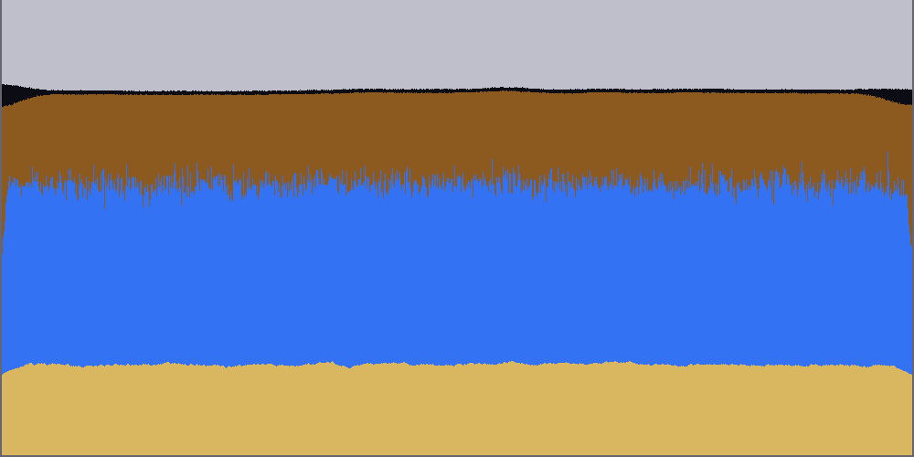

# Falling Sand — a powder game powered by NumSharp physics

A **falling-sand / powder** game where the physics of every grain, drop and puff is a **cellular
automaton computed by [NumSharp](../../README.md)** on an `(H, W)` grid. Paint sand, water, oil, smoke
and walls with the mouse and watch them fall, pile, pool, float, sink and rise — the whole world updates
through vectorized NumSharp array operations, not a per-cell loop.

It is the companion to [`UnityGravitySandbox`](../UnityGravitySandbox/) (orbital gravity); together they
show NumSharp driving two very different kinds of simulation. This one answers "more than gravity, with
water and sand."

> **The physics is verified, with or without Unity.** The simulation is pure NumSharp (no `UnityEngine`),
> so the `Verification/` console project compiles the *exact same source* Unity runs and asserts the
> cellular automaton's invariants — above all **mass conservation** — to the last cell. See
> [Verify the physics](#verify-the-physics).

---

## Play it now — no Unity required

Because the physics is Unity-independent NumSharp, there's a standalone terminal front-end that drives the
**exact same engine** and renders it live — you can play immediately without opening Unity:

```bash
cd Player
dotnet run -c Release -- --png out.png # render the sim at NATIVE 1000×500 to real PNG images (the high-pixel output)
dotnet run -c Release -- --play        # interactive: WASD/arrows move · Space pen · 1-6 material · E faucet · [ ] brush · Q quit
dotnet run -c Release -- --demo        # self-driving terminal showcase, 24-bit colour
dotnet run -c Release -- --ascii       # self-driving terminal showcase, plain text (for terminals without ANSI colour)
```

Pick the resolution with `--width`/`--height` (and upscale the PNG with `--scale`); `--png` defaults to
**1000×500**. A terminal can't show 1000×500 as text, so the terminal modes downscale to a readable
preview — use `--png` for a full-resolution image. Example (settled density layers, 1000×500):



The `--ascii` showcase settles a random mix into clean density layers — smoke on top, then oil, water and
sand at the bottom:

```
##""""""""""""""""""""""""""""""""""""""""""""""""""##   " = smoke  (lightest, rises)
##oooooooooooooooooooooooooooooooooooooooooooooooooo##   o = oil    (floats on water)
##~~~~~~~~~~~~~~~~~~~~~~~~~~~~~~~~~~~~~~~~~~~~~~~~~~~~##   ~ = water
##.................................................. ##   . = sand   (heaviest, sinks)
######################################################   # = wall
Layers by mean height (smaller = higher):
  Smoke:3.5  Oil:17.4  Water:29.9  Sand:43.2
```

The Unity version below is the same simulation with a mouse-painted, GPU-rendered front-end.

---

## What's sophisticated about it

- **Multi-material density stratification.** One rule — "a cell sinks past a lighter cell below it"
  (Archimedes) — makes sand sink, oil float on water, and smoke *rise* (its density is negative, so the
  air above it is heavier). Drop a mix in and it settles into ordered layers.
- **Granular vs fluid behaviour.** Sand **slides diagonally and piles** at an angle of repose; water and
  oil **spread and level flat**. Same swap primitive, different selection mask.
- **Mass-conserving vectorized update.** The naive "copy every cell down" duplicates or loses material on
  collisions; this uses a conflict-free swap that is provably a permutation of the grid, so nothing is
  created or destroyed (verified over long random runs).
- **Emergent water leveling** via a *randomized* flow direction — a lone surface cell random-walks to a
  drop instead of oscillating in place (the subtle bug that otherwise freezes water into a ramp).

The full derivation, including the mass-conservation argument and the water-leveling story, is in
**[docs/PHYSICS.md](docs/PHYSICS.md)**.

---

## Verify the physics

No Unity required. From this folder:

```bash
cd Verification
dotnet run -c Release
```

Expected output (abridged):

```
Mass conservation:
  [PASS] per-material counts invariant over 300 steps  Empty:676→676 Wall:317→317 Sand:343→343 Water:328→328 Oil:350→350 Smoke:290→290
Behaviors:
  [PASS] all 48 sand settled to the bottom 10 rows (48)
    mean rows  smoke=3.1 oil=17.9 water=27.5 sand=38.2  (smaller = higher)
  [PASS] density stratification: smoke < oil < water < sand
  [PASS] water leveled: occupies 2 rows (flat depth 2, started 12 tall)
  [PASS] disk brush painted 81 cells (~79 expected)
  [PASS] emitter added sand (0 → 151)
Reproducibility:
  [PASS] two runs with the same seed produce identical grids
  [PASS] boundary contains material: loose count 209 → 209

ALL CHECKS PASSED.
```

The harness references `NumSharp.Core` and pulls in the engine via
`<Compile Include="..\UnityProject\Assets\Scripts\Simulation\**\*.cs" />`, so it exercises the files the
Unity game runs. If a change breaks mass conservation (or any behaviour), this goes red.

---

## Architecture

```
UnityProject/Assets/Scripts/
├── Simulation/        ← pure C# + NumSharp, NO UnityEngine  ← the "backend to reality"
│   ├── Cell.cs             material ids + the density/fluid tables that ARE the physics
│   ├── GridOps.cs          whole-grid shifts + the conflict-free, mass-conserving swap
│   ├── PowderGrid.cs       the cellular automaton: vertical density, sand diagonal, fluid spread
│   └── FallingSandWorld.cs the game facade: brush, faucets, boundary walls, stepping
│
└── Game/              ← the Unity view (UnityEngine)
    ├── FallingSandGame.cs  ONE self-bootstrapping MonoBehaviour — the whole game
    ├── SandRenderer.cs     grid → a Texture2D (one texel per cell), uploaded each frame
    └── SandHud.cs          material palette + live stats overlay

Verification/          ← standalone console harness (references NumSharp.Core, compiles Simulation/)
```

The view is a pure function of the grid: each frame the game steps the `FallingSandWorld`, snapshots the
grid, and blits it to a texture. There are **no prefabs, scenes, sprites or material assets** — one
MonoBehaviour builds everything from code.

---

## Getting NumSharp into Unity

### 1. Build and drop in the DLL

```bash
dotnet build src/NumSharp.Core/NumSharp.Core.csproj -c Release -f net8.0
# copy bin/Release/net8.0/NumSharp.dll  ->  UnityProject/Assets/Plugins/NumSharp/NumSharp.dll
```

### 2. Use a JIT-capable, modern-.NET scripting backend

`NumSharp.Core` targets **.NET 8** and generates kernels via `System.Reflection.Emit` at runtime, so:

| Unity scripting backend | Works? | Why |
|---|---|---|
| **`.NET` / CoreCLR** (Unity 6.2+ preview) | ✅ **recommended, this sample's target** | runs `net8.0` assemblies and JITs the kernels |
| **Mono** | ⚠️ not with the stock build | `.NET Standard 2.1`-era; the `net8.0` DLL references APIs it lacks |
| **IL2CPP** | ❌ | ahead-of-time; `Reflection.Emit` is unavailable |

Set it under **Edit ▸ Project Settings ▸ Player ▸ Scripting Backend**, and make sure **Active Input
Handling** includes the legacy Input Manager.

### 3. Play

1. Open `UnityProject/` in Unity 6.2+.
2. Create an empty GameObject and add the **Falling Sand Game** component.
3. Press **Play**. The script builds the rest.

---

## Playing it

| Input | Action |
|---|---|
| `1`–`6` | pick material: Sand · Water · Oil · Smoke · Wall · Erase |
| Left-drag | paint / **pour** (hold to keep pouring) |
| `[` / `]` | smaller / larger brush |
| `,` / `.` | fewer / more physics substeps per frame (faster settling) |
| `E` | place a **faucet** of the current material at the cursor |
| `F` | remove all faucets |
| `Space` | pause / resume |
| `C` | clear loose material (keep walls) · `Shift+C` wipe everything |

Try: pour a **sand** heap and watch it form a cone; pour **water** beside it and watch it seep around and
level; drop **oil** on the water (it floats); bury **smoke** and watch it bubble up; build a **wall** funnel
and place a **faucet** above it.

### Materials

| Material | Behaviour |
|---|---|
| **Sand** | granular — falls, piles at ~45°, sinks through liquids |
| **Water** | liquid — falls, levels flat, sits below oil |
| **Oil** | lighter liquid — floats on water, levels flat |
| **Smoke** | gas — rises through everything, spreads under ceilings |
| **Wall** | immovable — build basins, funnels and dividers |
| **Erase** | paints empty (removes material) |

---

## Notes & limitations

- **Performance.** The update is pure-vectorized, so each step allocates several full-grid arrays. Measured
  cost: **~31 ms/step at 1000×500** (500k cells) and ~3.4 ms at 300×160. The Unity game defaults to
  **1000×500 with 1 substep/frame (~32 fps)**; lower the resolution or raise substeps to taste. Offline PNG
  rendering (`--png`) is unconstrained by frame rate, so it always runs at full resolution.
- **The Unity C# is written against the Unity 6 API but is not compiled here** (no editor in this repo); it
  was type-checked against a faithful `UnityEngine` shim. The *physics* it drives is machine-verified — see
  [above](#verify-the-physics).

## Learn more

- **[docs/PHYSICS.md](docs/PHYSICS.md)** — the cellular-automaton model, the mass-conservation proof, the
  density rule, and why fluid flow must be randomized.
- **[../UnityGravitySandbox/](../UnityGravitySandbox/)** — the companion N-body gravity game.
- **[../../README.md](../../README.md)** — NumSharp itself.
